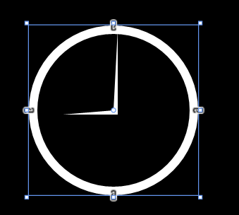
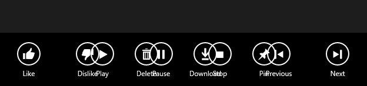
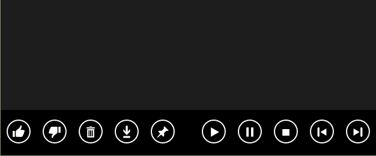
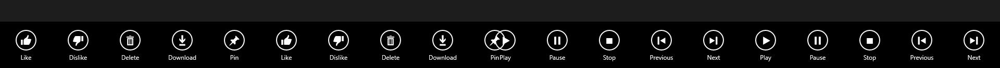
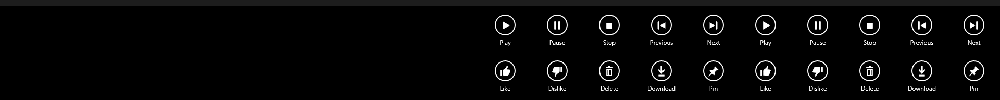
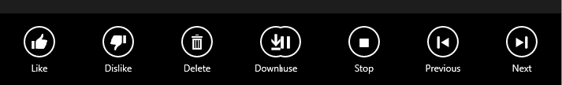

# 应用栏

基本的用法我们在教程前面的“页面布局与基本导航”中已经讲过了，这里继续补充关于应用栏的更多用法。

## Icon

在之前的学习中，我们知道 Icon 属性中有很多很多系统预定义，但也许这些还是不够的，现在就来增加几种用法。

字符集应用

```
<AppBarToggleButton Label="Sigma" Click="AppBarButton_Click">
    <AppBarToggleButton.Icon>
        <FontIcon Glyph="&#x03A3;"/>
    </AppBarToggleButton.Icon>
</AppBarToggleButton>
```

关于更多字符集的应用请访问维基百科。

## PathIcon

我们也可以用路径来绘制一个属于自己的图形哦，下面的图形大概就是 9 点钟的样子啦。

```
<AppBarToggleButton Label="Time" Click="AppBarButton_Click">
    <AppBarToggleButton.Icon>                              
        <PathIcon Data="F1 M 20,20 21,1L 21,21L 8,21"/>
    </AppBarToggleButton.Icon>
</AppBarToggleButton>
```



## 如何适应不同的分辨率

如何适应不同的分辨率这也是值得我们去解决的问题，毕竟不论是从 8 英寸的平板还是 25 英寸的台式机，甚至还有 4 英寸至 7 英寸的手机，在应用栏按钮太多而屏幕不够大时，多余的按钮该怎么办呢？

默认情况下，应用栏图标的宽度都是确定好的 100 像素哦。那么我们先来看两张图片好了，由于 Windows 10 是可以直接调整 Modern 应用的大小的（而不是 windows 8 那种只能全屏显示），所以我直接拉伸 Modern 大小以模拟分辨率的概率啦。




```
    <Page.BottomAppBar>
        <AppBar x:Name="bottomAppBar" IsSticky="True">
            <Grid>          
                <StackPanel x:Name="leftBottomAppBar" 
                            Orientation="Horizontal">
                    <AppBarButton Label="Like" Icon="Like"/>
                    <AppBarButton Label="Dislike" Icon="Dislike"/>
                    <AppBarButton Label="Delete" Icon="Delete"/>
                    <AppBarButton Label="Download" Icon="Download"/>
                    <AppBarButton Label="Pin" Icon="Pin"/>
                </StackPanel>
                <StackPanel x:Name="rightBottomAppBar" 
                        Orientation="Horizontal" HorizontalAlignment="Right">
                    <AppBarButton Label="Play" Icon="Play"/>
                    <AppBarButton Label="Pause" Icon="Pause"/>
                    <AppBarButton Label="Stop" Icon="Stop"/>
                    <AppBarButton Label="Previous" Icon="Previous"/>
                    <AppBarButton Label="Next" Icon="Next"/>
                </StackPanel>
            </Grid>
        </AppBar>
    </Page.BottomAppBar>
```

这里为了调试更加方便，所以使用了 IsSticky 属性。AppBarButton 还有一个很重要的属性哟，之前用不到，不过这里就是核心成员了呢，它就是 IsCompact。这个属性可以让应用栏按钮只显示图标而不显示文字，也就是 Label 啦。那么我们的工作就要围绕这个属性来展开了。

我们可以这样假设，有一个函数，它有一个布尔变量的参数，参数为真的话呢，那么所有的这些 AppBarButton 的 IsCompact 属性也为真。在以下这段代码中，我们先将 bottomAppBar 的自对象选取为 root，这样一来的话呢，如果应用中还有顶部的应用栏，就不会相互干扰啦。然后逐步取出 root 和 panel 中的自对象就好咯。

```
     private void AppBarButtonCompact(bool isCompact)
        {
            Panel root = bottomAppBar.Content as Panel;
            if(root!=null)
            {
                foreach(Panel panel in root.Children)
                {
                    foreach (ICommandBarElement child in panel.Children)
                    {
                        child.IsCompact = isCompact;
                    }
                }
            }
        }
```
接下来还需要判断到底需不需要启用 IsCompact，那这又是由什么决定的呢，既然前面提到是因为屏幕的分辨率，也就是所应用所占用的宽度会导致应用栏发生重叠，那么答案就毫无疑问了。看到下面的代码相信大家都明白了，至于为何是宽度的界限在 1000 呢，那是因为有 10 个 AppBarButton，前面也说了它们的宽度是 100。（不带 Label 的话呢，就只需要 60 像素啦。）

```
     void AppSizeChanged(object sender, SizeChangedEventArgs e)
        {
            if (e.NewSize.Width != e.PreviousSize.Width)
            {
                if (e.NewSize.Width < 1000)
                {
                    AppBarButtonCompact(true);
                }
                else
                {
                    AppBarButtonCompact(false);
                }
            }
        }
```
来张图片以示搞定这个问题了吧。



但是像我这么钻牛角尖的人，10 个 AppBarButton 用这种方式搞定了，那 20 个呢？我们就来演示一下，把之前 XAML 中的 AppBarButton 复制粘贴一番。如果是 2K、4K 的屏幕应对 20 个没问题啊，但我这 1920X1080 的屏幕就放不下了。



那么这又有什么办法可以解决的吗？当然有啦，将这 20 个图标切成 2 列就好啦。我们首先在 Grid 中添加一行。

```
<Grid.RowDefinitions>      
    <RowDefinition Height="auto"/>                     
    <RowDefinition Height="auto"/>                
</Grid.RowDefinitions>
```

再通过下面这张方式来调整它处于哪一行，以及在水平方向的右侧还是左侧。这里我将两行都设置在右侧啦。

```
leftBottomAppBar.SetValue(Grid.RowProperty, 1);
leftBottomAppBar.SetValue(HorizontalAlignmentProperty, HorizontalAlignment.Right);           
```

当然了，这样一来就可以放 40 个 AppBarButton 啦，如果缩小应用的大小的话为了容纳更多还可以用 IsCompact 属性呢。不过没有哪个应用做成这样吧。



另外呢，如果把应用栏设计成这样的话。

```
<Page.BottomAppBar>   
   <AppBar x:Name="bottomAppBar" IsSticky="True">            
      <Grid>                
         <Grid.ColumnDefinitions>                      
             <ColumnDefinition Width="*"/>                    
             <ColumnDefinition Width="*"/>                
         </Grid.ColumnDefinitions>               
         <StackPanel Grid.Column="0" x:Name="leftBottomAppBar"  Orientation="Horizontal" HorizontalAlignment="Left">                                     
             <AppBarButton Label="Like" Icon="Like"/>                
             <AppBarButton Label="Dislike" Icon="Dislike"/>           
             <AppBarButton Label="Delete" Icon="Delete"/>                 
             <AppBarButton Label="Download" Icon="Download"/>       
             <AppBarButton Label="Pin" Icon="Pin"/>                
         </StackPanel>     
         <StackPanel Grid.Column="1" x:Name="rightBottomAppBar" Orientation="Horizontal" HorizontalAlignment="Right">                                                     
             <AppBarButton Label="Play" Icon="Play"/>       
             <AppBarButton Label="Pause" Icon="Pause"/>       
             <AppBarButton Label="Stop" Icon="Stop"/>         
             <AppBarButton Label="Previous" Icon="Previous"/>       
             <AppBarButton Label="Next" Icon="Next"/>        
         </StackPanel>   
      </Grid>   
   </AppBar>  
</Page.BottomAppBar>
```

那么对于 Windows 10，在拉伸的过程中，中间部分的控件就会慢慢消失啦。以下这张图片呢，是我在拉伸到中间有2个控件刚好重叠的时候啦。至于把 AppBarButton 设计成这样是好是坏大家自己决定咯，我反正觉得这样不好呢。不过有意思的是，即便如此，它们彼此的 Click 事件还都是有效的噢，会区分左右两部分，而不会叠在一起。



当然啦，这个的应用远不是应用栏这么简单哟，对于其他的前景，比如有两个 TextBlock 在屏幕左右两侧，当应用把收缩变小之后也可以让这个 TextBlock 叠成 2 层在屏幕的一边。

## 在应用栏上添加菜单

我们都见过有菜单的应用栏按钮对吧，这个的实现其实也挺简单的。用 Flyout 属性就好了。

```
<Page.BottomAppBar>        
    <CommandBar> 
        <AppBarButton Icon="Rotate" Label="Rotate">                
            <AppBarButton.Flyout>                    
                <MenuFlyout>   
                   <MenuFlyoutItem Text="Rotate 90" Click="MenuFlyoutItem_Click" Tag="Rotate90"/>           
                   <MenuFlyoutItem Text="Rotate 180" Click="MenuFlyoutItem_Click" Tag="Rotate180"/>      
                   <MenuFlyoutItem Text="Rotate 270" Click="MenuFlyoutItem_Click" Tag="Rotate270"/>                    
               </MenuFlyout>                
           </AppBarButton.Flyout>            
       </AppBarButton>     
   </CommandBar>   
</Page.BottomAppBar>
```

Tag 属性，就相当于做一个标签。下面这段代码就让 Flyout 菜单发挥作用了。

```
private void MenuFlyoutItem_Click(object sender, RoutedEventArgs e)
{
    MenuFlyoutItem selectedItem = sender as MenuFlyoutItem;
    if (selectedItem != null)
    {
        if (selectedItem.Tag.ToString() == "Rotate90")
        {
            DoRotate(90);
        }
        else if (selectedItem.Tag.ToString() == "Rotate180")
        {
            DoRotate(180);
        }
        else if (selectedItem.Tag.ToString() == "Rotate270")
        {
            DoRotate(270);
        }
    }
}
```