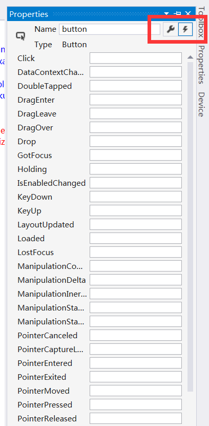
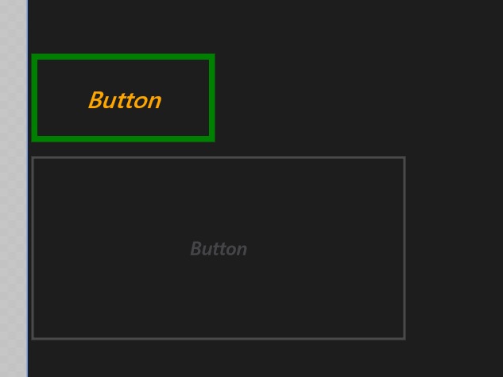

# 控件的属性、事件与样式资源

## 如何添加控件

添加控件的方式有多种，大家更喜欢下面哪一种呢？

- 使用诸如 Blend for Visual Studio 或 Microsoft Visual Studio XAML 设计器的设计工具。
- 在 Visual Studio XAML 编辑器中将控件添加到 XAML 代码中。
- 在代码中添加控件。 注意：当应用运行时会看到你在代码中添加的控件，但在 Visual Studio XAML 设计器中看不到。

前面我们通过在工具箱拖住控件以及直接在写 XAML 代码来设置控件，在教程的后面，我们会看到在 C# 后台代码中添加控件。Blend 我们暂时还没有用到，不过其在绘制图形和动画上可谓非常强大和优秀。

## 设置控件的属性

控件的属性相比大家都已经会用了，一来可以直接在XAML中添加属性，二来可以在属性视图中添加和修改属性。



## 为控件添加事件

如果要添加和修改事件呢，同样在属性视图中，点击右上角的闪电图标即可。如果要添加 Click 事件，那么在 Click 的输入框中输入好事件名称后直接按 Enter 即可。此时 VS 就会自动跳转到 C# 后台代码中，第一个参数 sender 是对处理程序所附加的对象的应用，第二参数是事件数据，它通常在签名中显示为 e 参数。

```
private void btnSetStyle_Click(object sender, RoutedEventArgs e)
{
    Button b = (Button)sender;
    b.Height = 400;
    b.Width = 320;
}
```

上面的这段代码这会将所点击的 Button 的高设置为 400，宽设置为 320；除了这种方式外，也可以按如下操作，其中 btnSetStyle 是当前 Button 的名字：

```
private void btnSetStyle_Click(object sender, RoutedEventArgs e)
{
    btnSetStyle.Height = 400;
    btnSetStyle.Width = 320;
}
```

除此之外，我们也可以不在 XAML 中定义 Click 事件，按照如下操作也可以达到相同的效果，它会将两个事件相互关联。

```
public MainPage()
{
     this.InitializeComponent();
     btnSetStyle.Click += new RoutedEventHandler(btnSetStyle_Click);
}
private void btnSetStyle_Click(object sender, RoutedEventArgs e)
{
    btnSetStyle.Height = 400;
    btnSetStyle.Width = 320;
}
```

## 为控件设置样式资源

即便没有添加过资源，也不清楚什么是样式，没关系，想必大家都玩过 2048 吧。游戏中有许多方格，那这些方格的样式会不会一个个去定义呢，当然不是，可以直接用样式资源来定位到所有的 Button。

以下是一个基本样式，`<Page.Resources/>` 应该在最外层的 Grid 外面，和 AppBar 等位于同一级别。其内有一个 Style 样式，TargetType 指向目标控件，Property 为目标空间的具体属性名，其值用 Value 列出即可。后面的容器部分我们暂时不作考虑啦，后面都会讲解的。

```
<Page.Resources>
   <Style TargetType="Button">
      <Setter Property="FontWeight" Value="Bold"/>
      <Setter Property="FontSize" Value="40"/>
      <Setter Property="HorizontalAlignment" Value="Center"></Setter>
      <Setter Property="VerticalAlignment" Value="Center"></Setter>
      <Setter Property="Background" Value="Gray"></Setter>
      <Setter Property="Width" Value="100"></Setter>
      <Setter Property="Height" Value="100"></Setter>
      <Setter Property="Template">
          <Setter.Value>
              <ControlTemplate TargetType="Button">
                  <Grid x:Name="Grid" Background="Transparent">
                      <Border x:Name="Border" Width="{TemplateBinding Width}"  
                      Height="{TemplateBinding Height}" Background="{TemplateBinding  
                      Background}" >
                      <ContentPresenter x:Name="ContentPresenter"  
                      ContentTemplate="{TemplateBinding ContentTemplate}"  
                      Content="{TemplateBinding Content}" HorizontalAlignment="Center"  
                      VerticalAlignment="Center"/>
                       </Border>
                   </Grid>
               </ControlTemplate>
           </Setter.Value>
       </Setter>
    </Style>
</Page.Resources>
```

但是这里也有一个问题，如果我们有 10 个 Button 控件，却只想其中 8 个用到这些定义，另外 2 个想用另一种控件，那该怎么办呢？

将样式定义为资源，其实是有 2 中方式的。

一种就是直接用 Style 的 TargetType 属性来定义到所有的目标控件。

另一种则除了用 TargetType 属性外，还可以用 x:key 属性，然后再具体的控件中庸显式的关键字 StaticResource 来设置具体的 Style 属性。

```
<Page.Resources>     
     <Style TargetType="Button">              
         <Setter Property="FontStyle" Value="Oblique" />
         <Setter Property="FontSize" Value="20" />
         <Setter Property="BorderBrush" Value="Green" />
         <Setter Property="BorderThickness" Value="5" />
         <Setter Property="Foreground" Value="Orange" />
         <Setter Property="Height" Value="80"/>
         <Setter Property="Width" Value="160"/>
     </Style>
     <Style x:Key="OtherStyle" TargetType="Button">
         <Setter Property="FontStyle" Value="Italic" />
         <Setter Property="FontSize" Value="16" />
         <Setter Property="Foreground" Value="Lavender" />
         <Setter Property="Height" Value="160"/>
         <Setter Property="Width" Value="320"/>
         <Setter Property="Opacity" Value="0.2"/>
     </Style>                                                            
</Page.Resources>
```

具体效果见下图，其中 Opacity 属性为透明度。



大家都知道类可以继承，样式也是可以继承的。