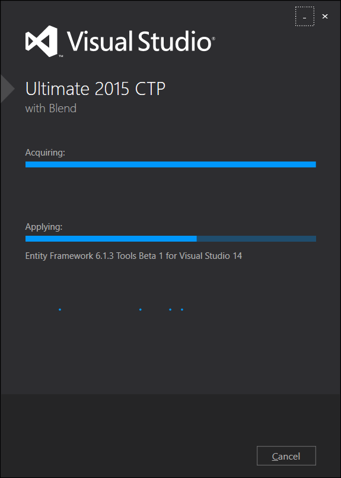
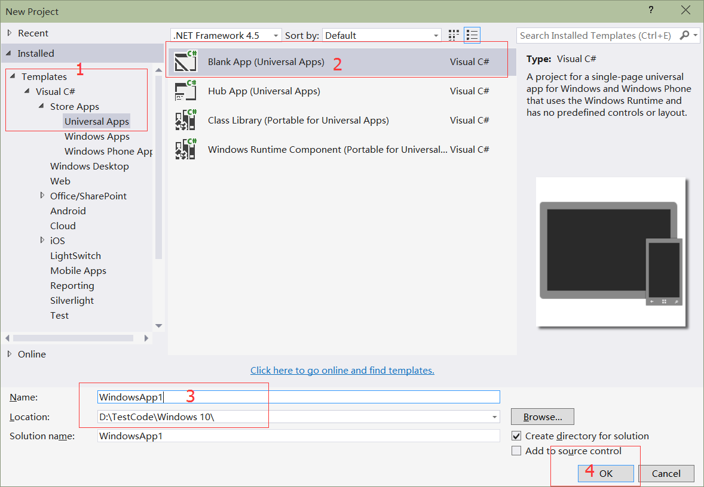
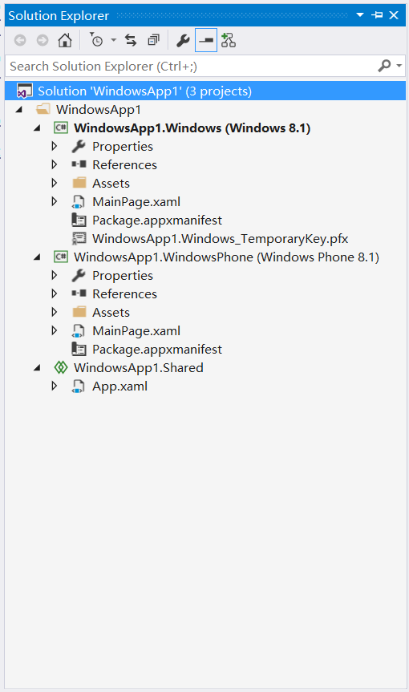
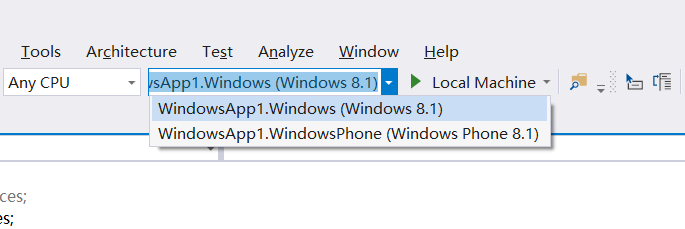
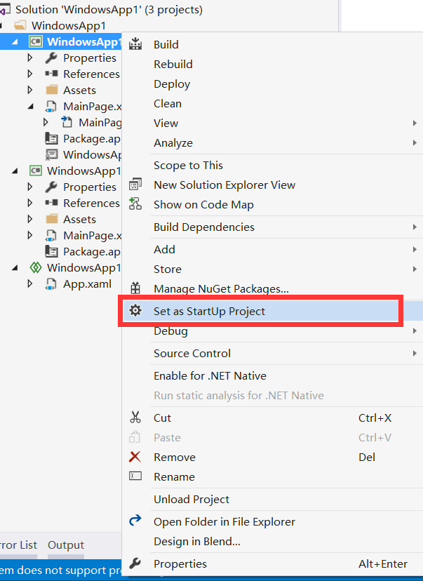
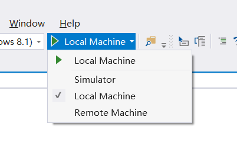
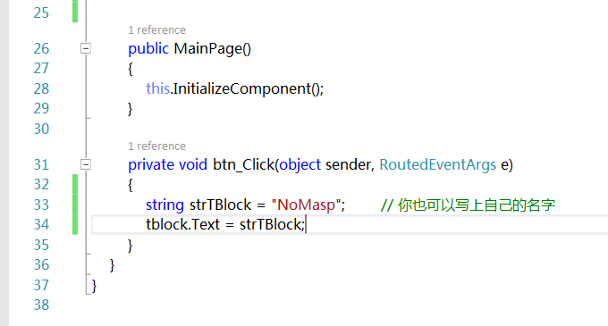
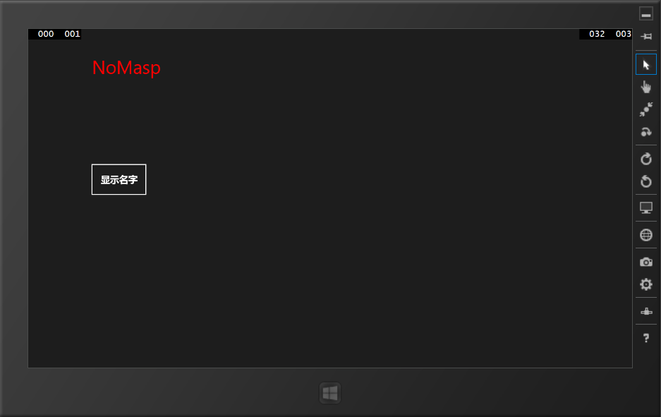

# 动手创建第一个应用

## 新建工程



如果不是装的固态那么安装的过程会是非常漫长的，请大家耐心等待。装好之后就可以开工啦。

Ctrl+Shift+N 直接呼出新建项目窗口。



新建完成后再解决方案管理器中会是如下界面：



如果没有显示出解决方案管理器，可以按 Ctrl+W，S。或者也可以在最上面的工具栏中点击视图（View）。在Solution 'WindowsApp1'上右键可以继续再创建第二个项目。

如图中所示，共有 3 个部分：

1）WindowsApp1.Windows (Windows 8.1)

2）WindowsApp1.WindowsPhone (Windows Phone 8.1)

显然这两个分别是 Windows 应用中的 Windows 8.1 和 Windows Phone 8.1 部分。其下又有：

- Properties：应用相关的一些版本号等。
- References：引用，主要是用来引用第三方的东东，比如广告啦。
- Assets：可以将 App 所用到的素材资源等放在这个文件夹中。
- MainPage.xaml：XAML 代码就是在这里写的哦，C# 代码需要在点击 `MainPage.xaml` 左边的三角形后出现的MainPage.xaml.cs 文件中写。
- Package.appxmanifest：应用包的一些清单，后面用到的时候再细讲啦。

剩下一个就是相关的证书了。

3）WindowsApp1.Shared

这个就是 Windows App（通用应用）的精髓啦，比如可以把类、资源文件等放在这里啦。

## 调试程序



在这里可以设置调试 Windows 8.1 应用还是 Windows Phone 8.1 应用。





在这里可以选择在本机调试或者虚拟机中调试。

## 动手操作

在 MainPage.xaml 中写下以下代码：

```
<Grid Background="{ThemeResource ApplicationPageBackgroundThemeBrush}">
    <TextBlock Name="tblock" Text="" FontSize="50" Foreground="Red"  Margin="173,78,940,498"/>    
    <Button Name="btn" Content="显示名字" Click="btn_Click" Width="155" FontSize="25"  
    Height="90" Margin="170,286,0,392"/>  
</Grid>
```

只用到了两个 TextBlock 和 Button 两个控件，其中的属性：

- Name：控件的名字
- Text：TextBlock 控件显示的文本
- FontSize：字体
- Width和Height：宽和高
- Margin：边距，具体用法在后面的博客中会有介绍
- Content：内容，此时会显示在 Button 控件上
- Foreground：字体颜色

还有一个事件：

- Click：点击事件

用鼠标双击 btn_Click 后按 F12 可以快速在 C# 文件中生成相应的函数。



然后本地计算机或虚拟机上调试就可以啦。

