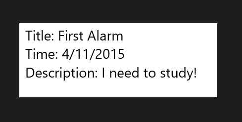
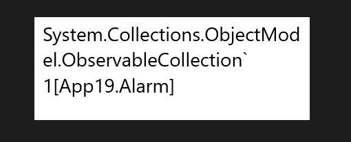
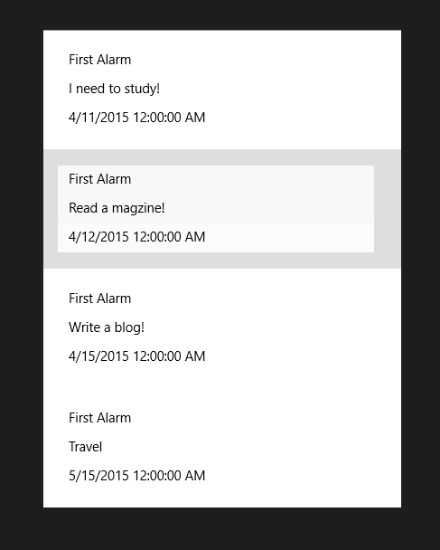
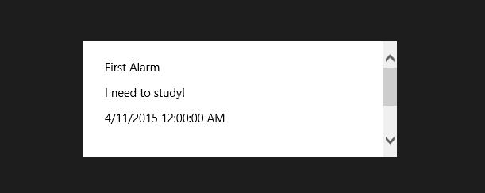
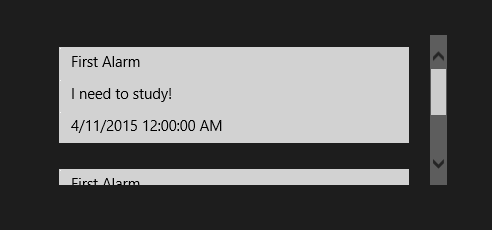
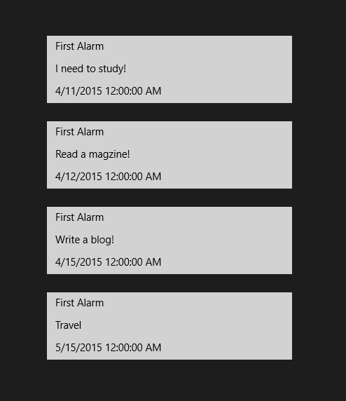
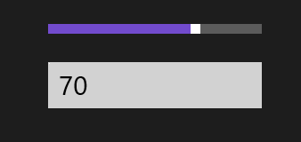
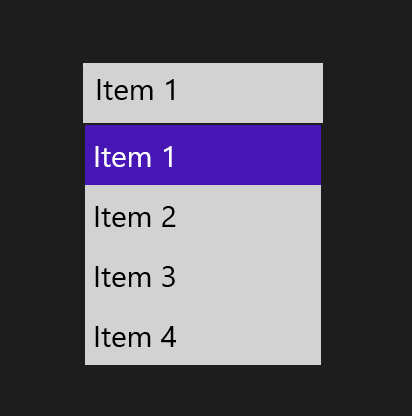
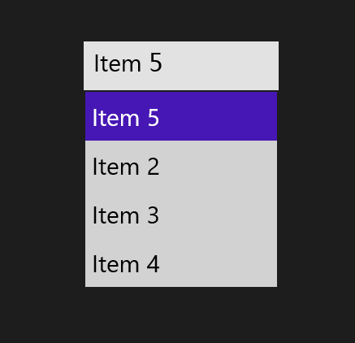

# 数据绑定介绍

## 简单的数据绑定示例

相比于理论，我更倾向于从实践中开始，尤其是对于数据绑定。那么，我们先来看看几个简单的例子。

### 数据绑定到 TextBox

我们依旧使用前面的闹钟类来开始。在下面的代码中，我们有属性、构造函数，还有一个 ToString() 方法的重载。之所以重载这个方法是因为我们想在最后绑定的时候，这三个属性能够在 TextBox 上显示得更加工整。

```
    public class Alarm
    {
        public string Title { get; set; }
        public string Description { get; set; }
        public DateTime AlarmTime { get; set; }
        public Alarm() { }
        public Alarm(string title, string description,DateTime alarmTime)
        {
            Title = title;                  
            Description = description;
            AlarmTime = alarmTime;
        }
        public override string ToString()
        {
            return "Title: " + Title +"\n"+ "Time: "+ AlarmTime.ToString("d") + "\n"+ "Description: " + Description;
        }
    }
```

接下来再在 XAML 中添加 TextBox 控件如下，因为 TextBox 此时是用作显示而非输入，所以建议设置其的只读属性。数据绑定的核心就是 Text 属性中的那么一个 Binding 关键字。

```
<TextBox x:Name="textBox1" FontSize="28" Height="150" Width="400"
                    TextWrapping="Wrap" Text="{Binding}" IsReadOnly="True"/>
```

但是光这样还不够，我们还需要在后台代码中将数据绑定到 textBox1 的 DataContext（数据上下文）中。

```
textBox1.DataContext = new Alarm(
                "First Alarm", "I need to study!", new DateTime(2015, 4, 11));
```

相信大家并不为觉得这个很难，相反我在学数据绑定的时候一上来就是一大堆理论，以至于我对数据一词有了阴影——所以我学数据结构非常痛苦。



### 数据绑定到 ComboBox

才保存一个闹钟没太大意思，我们多来几个。

```
        public ObservableCollection<Alarm> UsefulAlarm = new ObservableCollection<Alarm>();
        public MainPage()
        {
            this.InitializeComponent();
            UsefulAlarm.Add(new Alarm("First Alarm", "I need to study!", new DateTime(2015, 4, 11)));
            UsefulAlarm.Add(new Alarm("First Alarm", "Read a magzine!", new DateTime(2015, 4, 12)));
            UsefulAlarm.Add(new Alarm("First Alarm", "Write a blog!", new DateTime(2015, 4, 15)));
            UsefulAlarm.Add(new Alarm("First Alarm", "Travel", new DateTime(2015, 5, 15)));
            textBox1.DataContext = UsefulAlarm;
        }
```
但是……



很显然我们用了 `ObservableCollection< T >` 类，它为数据绑定提供了一个集合，这是因为它实现了 INotifyPropertyChanged 和 INotifyCollectionChanged 接口。顾名思义，当属性改变时，它可以通知它所绑定的控件，并且如果你希望该空间能够同步更新，则将用于绑定的对象也实现 INotifyPropertyChanged 接口。这个类好归好，但相对于 TextBox 而言算有些高端了，以至于它无法显示出来。但是我们可以用 ComboBox 来代替它，我们的类并不需要修改，前面的 UsefulAlarm 实例化也都不用改，只需要将 textBox1 改成 comboBox1 即可。以下是新的 ComboBox 代码。

```
       <ComboBox Name="comboBox1" ItemsSource="{Binding}" FontSize="28" Height="150" Width="400">
            <ComboBox.ItemTemplate>
                <DataTemplate>               
                    <StackPanel Orientation="Vertical" Margin="8">
                        <TextBox Width="350"  TextWrapping="Wrap" Text="{Binding Title}" IsReadOnly="True"/>
                        <TextBox Width="350"  TextWrapping="Wrap" Text="{Binding Description}" IsReadOnly="True"/>
                        <TextBox Width="350"  TextWrapping="Wrap" Text="{Binding AlarmTime}" IsReadOnly="True"/>
                    </StackPanel>                    
                </DataTemplate>
            </ComboBox.ItemTemplate>     
        </ComboBox>
```

在图示中我们也容易发现 TextBox 和 ComboBox 两个控件的 Width 属性的应用区别。在 TextBox 中，我们将数据绑定到 Text 中；而在 ComboBox 中，我们则是将数据绑定到 ItemsSource 中，简单的说就是 ComboBox 拿来所有的数据，再将它们分成小的细节发给它的子对象，这些子对象都在 ComboBox 的 DataTemplate（数据容器）中。



在这里我们并没有用到前面所重载的 ToString() 函数，因为我们已经分别将 Title、Description、AlarmTime 绑定到相应的 TextBox 控件了。那图示中又为什么这些数据都是一行一行的表示呢，这都是布局控件 StackPanel 的功劳，全靠它的Orientation属性。如果将这个属性设置成 Horizontal 呢，那标题、描述已经时间就是全排在一行了。


### 数据绑定到 ListBox

听说 ListBox 和 ComboBox 很类似哦，它们都是 Box……XBox 呀。博主我有点懒，那可不可以直接将 ComboBox 的名字改成 ListBox 就直接运行呢，答案是可以哦！那么区别到底在哪里呢？看看这张图就知道啦。



咦？怎么只有一条闹钟了？别惊慌……拖动右边的滚动条就可以查看到全部的闹钟咯。我真的只把 ComboBox 改成 ListBox 还有相应的 Name 属性（包括后台代码中的名字哦），以下就是完整的代码啦，我会骗你？

```
        <ListBox Name="listBox1" ItemsSource="{Binding}" FontSize="28" Height="150" Width="400">
            <ListBox.ItemTemplate>
                <DataTemplate>
                    <StackPanel Orientation="Vertical" Margin="8">
                        <TextBox Width="350"  TextWrapping="Wrap" Text="{Binding Title}" IsReadOnly="True"/>
                        <TextBox Width="350"  TextWrapping="Wrap" Text="{Binding Description}" IsReadOnly="True"/>
                        <TextBox Width="350"  TextWrapping="Wrap" Text="{Binding AlarmTime}" IsReadOnly="True"/>
                    </StackPanel>
                </DataTemplate>
            </ListBox.ItemTemplate>
        </ListBox>
```

### 数据绑定到 ListView

看了前面的代码相信我没有骗你吧，童鞋们看到 ListBox 有没有想到 ListView 呢？我要是想说还是和前面一样只用改名字等就可以用 ListView，你还是不信么？

```
        <ListView Name="listView1" ItemsSource="{Binding}"  FontSize="28" Height="150" Width="400">
            <ListView.ItemTemplate>
                <DataTemplate>
                    <StackPanel Orientation="Vertical" Margin="8">
                        <TextBox Width="350"  TextWrapping="Wrap" Text="{Binding Title}" IsReadOnly="True"/>
                        <TextBox Width="350"  TextWrapping="Wrap" Text="{Binding Description}" IsReadOnly="True"/>
                        <TextBox Width="350"  TextWrapping="Wrap" Text="{Binding AlarmTime}" IsReadOnly="True"/>
                    </StackPanel>
                </DataTemplate>
            </ListView.ItemTemplate>
        </ListView>
```



当然了，还是用右边的滚动条来下拉以查看所有的数据。不过 ListView 君的最佳姿势不是这样哦，将 Height 改为 600 才是呢。看下图——这才是高大上的 ListView 君嘛！



好了不玩了，GridView 也是可以这样弄得，不信你试试。

## 再谈数据绑定

1.我们为什么要用数据绑定

很显然，我们不可能把所有的数据全部固定在特定的控件上。比如，游戏的积分、设定的闹钟、天气预报甚至的通讯类的消息，它们都并非是一成不变的。但是也并非所有的控件都需要绑定，比如你的 App 的名字、发送消息时所用的发送按钮上面的文本等。

2.那数据和 UI 之间又有哪些关系呢

首先我们得明确，数据的显示和其后台的管理是不一样的。数据与UI绑定之后，我们的数据就可以在这两者之间进行沟通，如果数据发生变化时，绑定到数据的 UI 则会自动将相应的属性进行调整，不仅仅是前面用到的 Text 属性，还有 FontSize、Width、Foreground、Image 属性都可以。

3.数据绑定到底是绑定什么

首先，我们得有绑定源，这些就是我们需要绑定的数据，没有数据，即使你绑定了，它也显示不出来。
其次，我们还需要绑定目标，也就是 Framework 类的 DependencyProperty 属性，说得白话文点就是将数据绑定到 UI 的相应属性上。

最后，我们还需要一个 Binding 对象，它就像是搬运工，没有它，数据也是无法动弹的。它能够帮助我们将数据从数据源移动到绑定目标，并且将绑定目标的相应消息通知给绑定源。它还有一些巧妙的工具，能够将绑定源的数据加工成特定的格式。

4.绑定源有哪些

所有的公共语言运行时对象，我们前面用的Alarm类就是这种对象，另外UI元素也是哦。

5.听说有的搬运工只能将数据源的数据一次性搬到绑定目标后就不再搬了，而有的搬运工则会在数据修改后再搬一次，甚至还有的能够在绑定目标更改后再将数据搬回到数据源

- OneTime 绑定：这个搬运工的工作就是第一种，它只负责在创建时将源数据更新到绑定目标。
- OneWay 绑定：这是系统默认的搬运工，它是第二种，负责在创建时以及源数据发生更改时更新绑定目标。
- TwoWay 绑定：这个搬运工则是第三种，它能够在绑定源和绑定目标的一边发生更改时同时更新绑定源和绑定目标。但它在一种时候却会偷懒，那就是对于TextBox.Text每次点击之后，它就不会将这个 Text 属性的更改更新到绑定源。不过如果碰到 Boss，它也只能继续搬了。那就是将 Binding.UpdateSourceTrigger 设置成PropertyChanged。而默认情况下，只有 TextBox 失去焦点时才会去更新。

以下分别是 OneWay 和 TwoWay 的例子：

```
        <StackPanel Width="240" Orientation="Vertical" HorizontalAlignment="Center" VerticalAlignment="Center">
            <Slider Name="slider1" Minimum="0" Maximum="100"/>
            <TextBox FontSize="30" 
                     Text="{Binding ElementName=slider1,Path=Value,Mode=OneWay}" />
        </StackPanel>
```
拖动滑动条，就可以看到在 TextBox 中显示它的值的变化了。如果希望它只变化一次，那就将代码中的 OneWay 改成 OneTime 即可。



```
        <StackPanel Width="240" Orientation="Vertical" HorizontalAlignment="Center" VerticalAlignment="Center">
            <TextBox FontSize="30"  Name="textBox" Height="60"                
                     Text ="{Binding ElementName=listBox1, Path=SelectedItem.Content,  Mode=TwoWay}">
            </TextBox>   
            <ListBox FontSize="30" Name="listBox1">
                <ListBoxItem Content="Item 1"/>
                <ListBoxItem Content="Item 2"/>
                <ListBoxItem Content="Item 3"/>
                <ListBoxItem Content="Item 4"/>
            </ListBox>
        </StackPanel>
```
如下图所示，点击 Item 1 后 TextBox 则会显示相应的 Item 1，将 TextBox 中的 Item 1 修改为 Item 5 后再 ListBox 中也自动修改成了 Item5。





简单示例：Foreground 的数据绑定

前面已经说到了 Foreground 也可以绑定，想不想试试呢。我们现在 TextBox 中写一个 TextBox，然后在后台代码中添加一个绑定就可以了。这个和前面的比较简单，这里只是用来引出后面的东东哦

```
 <TextBox Name="textBox" Width="200" Height="100" IsReadOnly="True"
                 FontSize="32" Text="Text" Foreground="{Binding ForeBrush}"/>
```

```
textBox.Foreground = new SolidColorBrush(Colors.BlueViolet);
```
