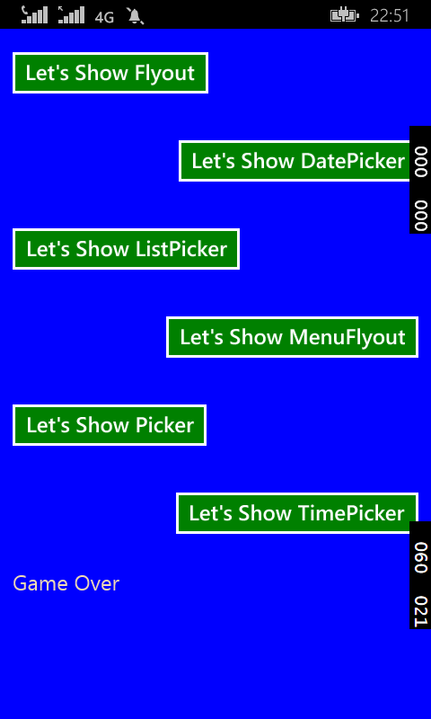
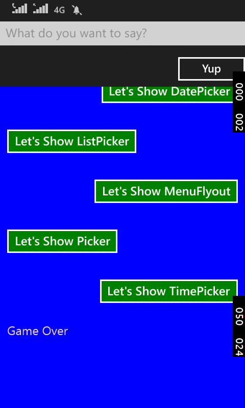
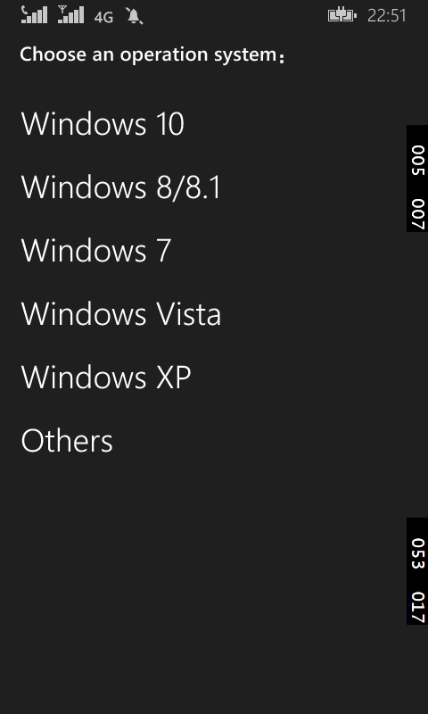
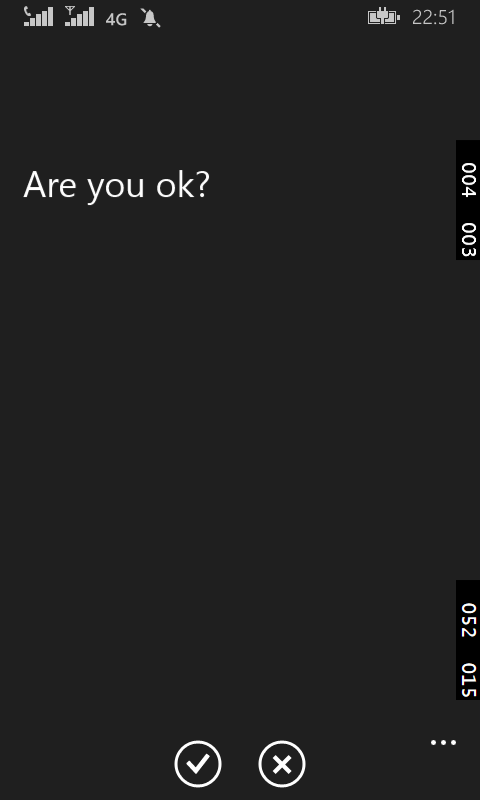

# DatePickerFlyout 等的使用

这一篇讲解在 WP 上 DataPickerFlyout 和 TimePickerFlyout 的使用，但它们只放在 WP 上哦，也正因此才将这一节放到最后一章的。

```
<Grid Background="Blue">  
    <Grid.RowDefinitions>
        <RowDefinition Height="*"/>
        <RowDefinition Height="*"/>
    </Grid.RowDefinitions>                      
    <StackPanel Grid.Row="0" Margin="12" Orientation="Vertical">     
        <Button Content="Let's Show DatePicker" >
            <Button.Flyout>        
                <DatePickerFlyout x:Name="datePickerFlyout" Title="选择日期" 
                     DatePicked="datePickerFlyout_DatePicked" Closed="datePickerFlyout_Closed" />
            </Button.Flyout>
        </Button>               
        <DatePicker Header="Date"  Margin="4" />          
        <TextBlock Name="textBlockDate" FontSize="20" Margin="4" />            
    </StackPanel>
    <StackPanel Grid.Row="1" Margin="12" Orientation="Vertical">
        <Button Content="Let's Show TimePicker" >
            <Button.Flyout>
                <TimePickerFlyout x:Name="timePickerFlyout" Title="选择时间" 
                    TimePicked="timePickerFlyout_TimePicked" Closed="timePickerFlyout_Closed" />
            </Button.Flyout>
        </Button>
        <TimePicker Header="Time" Margin="4" />
        <TextBlock Name="textBlockTime" FontSize="20" Margin="4"/>             
    </StackPanel>                                      
</Grid>
```

后台事件如下：

```
public sealed partial class MainPage : Page
{
    public MainPage()
    {
        this.InitializeComponent();
        this.NavigationCacheMode = NavigationCacheMode.Required;
    }
    protected override void OnNavigatedTo(NavigationEventArgs e)
    {
        // 令天数加1
        datePickerFlyout.Date = DateTimeOffset.Now.AddDays(1);
        // 设置可选择的最大年份和最小年份
        datePickerFlyout.MinYear = DateTimeOffset.Now.AddYears(-100);   
        datePickerFlyout.MaxYear = DateTimeOffset.Now.AddYears(100);
        // 此处也可以令“年“、”月“、”日“中的某一个不显示
        datePickerFlyout.YearVisible = true;
        datePickerFlyout.MonthVisible = true;       
        datePickerFlyout.DayVisible = true;
        // 选择的历法
        // （Gregorian 公历, Hebrew 希伯来历, Hijri 回历, Japanese 日本历, Julian 罗马儒略历,  
         Korean 朝鲜历, Taiwan 台湾历, Thai 泰国历, UmAlQura 古兰经历）
        datePickerFlyout.CalendarIdentifier = CalendarIdentifiers.Gregorian;                                            
        // Time - TimePicker 控件当前显示的时间
        timePickerFlyout.Time = new TimeSpan(18, 0, 0);
        // 设置TimePickerFlyout的分钟选择框内数字的增幅
        timePickerFlyout.MinuteIncrement=2; 
        //设置为24小时制，也可以为12小时制
        timePickerFlyout.ClockIdentifier = ClockIdentifiers.TwentyFourHour;                 
    }
    // 当用户点击DatePicker的完成按钮后激活该事件
    private void datePickerFlyout_DatePicked(DatePickerFlyout sender, DatePickedEventArgs args)
    {                      
        textBlockDate.Text = args.NewDate.ToString("yyyy-MM-dd hh:mm:ss");
        textBlockDate.Text += Environment.NewLine;
    }
    // 当用户点击DatePicker的取消按钮或手机的返回按钮后激活该事件，当点击完成按钮后也将调用该事件
    private void datePickerFlyout_Closed(object sender, object e)
    {
        textBlockDate.Text += "You just close the DatePickerFlyout.";
        textBlockDate.Text += Environment.NewLine;
    }
    // 当用户点击TimePicker的完成按钮后激活该事件
    private void timePickerFlyout_TimePicked(TimePickerFlyout sender, TimePickedEventArgs args)
    {
        // e.OldTime - 原时间
        // e.NewTime - 新时间
        textBlockTime.Text = args.NewTime.ToString("c");
        textBlockTime.Text += Environment.NewLine;
    }
    // 当用户点击TimePicker的取消按钮或手机的返回按钮后激活该事件，当点击完成按钮后也将调用该事件
    private void timePickerFlyout_Closed(object sender, object e)
    {
        textBlockTime.Text += "You just close the TimePickerFlyout.";
        textBlockTime.Text += Environment.NewLine;
    }
}
```

简单的讲，Flyout 有两种创建方式，一种就是上面的通过 Button 的 Flyout 属性。另一种是通过 FlyoutBase.AttachedFlyout 属性给任何的 FrameworkElement 对象添加它。

关于 FrameworkElement 的更多知识，可以访问以下链接。

<https://msdn.microsoft.com/zh-cn/library/vstudio/system.windows.frameworkelement(v=vs.100).aspx>

<https://msdn.microsoft.com/en-us/library/system.windows.frameworkelement(v=vs.110).aspx>

而 Flyout 则有 6 种不同的类型：Flyout、DatePickerFlyout、ListPickerFlyout、MenuFlyout、TimePickerFlyout。

时间紧迫就直接 Show 代码了。

XAML 代码：

```
	<Page.Resources>
        <Style TargetType="Button">
            <Setter Property="Margin" Value="12"/>
            <Setter Property="FontSize" Value="20"/>
            <Setter Property="Foreground"  Value="White"/>
            <Setter Property="Background" Value="Green"/>
        </Style>
    </Page.Resources>
    <Grid Background="Blue">
        <StackPanel Orientation="Vertical">
            <!-- Flyout -->
            <Button Content="Let's Show Flyout">
                <Button.Flyout>
                    <Flyout>
                        <StackPanel >
                            <TextBox PlaceholderText="What do you want to say?"/>
                            <Button HorizontalAlignment="Right" Content="Yup"/>
                        </StackPanel>
                    </Flyout>
                </Button.Flyout>
            </Button>
            <!-- DatePickerFlyout -->
            <Button Content="Let's Show DatePicker" HorizontalAlignment="Right">
                <Button.Flyout>
                    <DatePickerFlyout Title="You need to choose Date: "  DatePicked="DatePickerFlyout_DatePicked"/>
                </Button.Flyout>
            </Button>
            <!-- ListPickerFlyout -->
            <Button Content="Let's Show ListPicker" >
                <Button.Flyout>
                    <ListPickerFlyout x:Name="listPickerFlyout" Title="选择操作系统："  
                    ItemsPicked="listPickerFlyout_ItemsPicked"  >
                        <ListPickerFlyout.ItemTemplate>
                            <DataTemplate>
                                <TextBlock Text="{Binding}" FontSize="30"></TextBlock>
                            </DataTemplate>
                        </ListPickerFlyout.ItemTemplate>
                    </ListPickerFlyout>
                </Button.Flyout>
            </Button>
            <!--  MenuFlyout -->
            <Button x:Name="menuFlyoutButton" Content="Let's Show MenuFlyout" HorizontalAlignment="Right">
                <Button.Flyout >
                    <MenuFlyout>
                        <MenuFlyoutItem Text="You just say yes?" Click="MenuFlyoutItem_Click"/>
                        <MenuFlyoutItem Text="You just say no?" Click="MenuFlyoutItem_Click"/>
                        <MenuFlyoutItem Text="You say nothing..." Click="MenuFlyoutItem_Click"/>
                    </MenuFlyout>
                </Button.Flyout>
            </Button>
            <!--  PickerFlyout -->
            <Button Content="Let's Show Picker" >
                <Button.Flyout>
                    <PickerFlyout  Confirmed="PickerFlyout_Confirmed" ConfirmationButtonsVisible="True">
                        <TextBlock Text="Are you ok?" FontSize="30" Margin="0 100 0 0"/>
                    </PickerFlyout>
                </Button.Flyout>
            </Button>
            <!-- TimePickerFlyout -->
            <Button Content="Let's Show TimePicker" HorizontalAlignment="Right">
                <Button.Flyout>
                    <TimePickerFlyout Title="You need to choose Time: "  TimePicked="TimePickerFlyout_TimePicked"/>
                </Button.Flyout>
            </Button>
            <!-- FlyoutBase -->
            <TextBlock Text="Game Over" Margin="12" Foreground="Wheat" Tapped="TextBlock_Tapped" FontSize="20">
                <FlyoutBase.AttachedFlyout>
                    <Flyout>
                        <TextBox Text="哎哟，不错哦！"/>
                    </Flyout>
                </FlyoutBase.AttachedFlyout>
            </TextBlock>
        </StackPanel>
    </Grid>
```

后台 C# 代码：

```
    public sealed partial class MainPage : Page
    {
        public MainPage()
        {
            this.InitializeComponent();
            // 绑定List数据到ListPickerFlyout
            listPickerFlyout.ItemsSource = new List<string> { "Windows 10", "Windows  
            8/8.1", "Windows 7", "Windows Vista", "Windows XP","Others" };
        }
        // DatePickerFlyout的日期选中事件，此处事件内有是包含日期的MessageDialog控件
        private async void DatePickerFlyout_DatePicked(DatePickerFlyout sender, DatePickedEventArgs args)
        {
            await new MessageDialog(args.NewDate.ToString()).ShowAsync();
        }
        // ListPickerFlyout的选中事件，选择列表中的一项后会以弹窗的方式显示出来
        private async void listPickerFlyout_ItemsPicked(ListPickerFlyout sender, ItemsPickedEventArgs args)
        {
            if (sender.SelectedItem != null)
            {
                await new MessageDialog("You choose: " + sender.SelectedItem.ToString()).ShowAsync();
            }
        }
        // MenuFlyout的菜单选项的点击事件，将选择的本文赋值给Content
        private void MenuFlyoutItem_Click(object sender, RoutedEventArgs e)
        {
            menuFlyoutButton.Content = (sender as MenuFlyoutItem).Text;
        }
        // PickerFlyout的确认事件，此处事件内有是包含字符串的MessageDialog控件
        private async void PickerFlyout_Confirmed(PickerFlyout sender, PickerConfirmedEventArgs args)
        {
            await new MessageDialog("You choose ok").ShowAsync();
        }
        // TimePickerFlyout的时间选中事件，此处事件内有是包含所选时间的MessageDialog控件
        private async void TimePickerFlyout_TimePicked(TimePickerFlyout sender, TimePickedEventArgs args)
        {
            await new MessageDialog(args.NewTime.ToString()).ShowAsync();
        }          
        // 通过FlyoutBase.ShowAttachedFlyout方法来展示出Flyout控件
        private void TextBlock_Tapped(object sender, TappedRoutedEventArgs e)
        {
            FrameworkElement element = sender as FrameworkElement;
            if (element != null)
            {
                FlyoutBase.ShowAttachedFlyout(element);
            }
        }    
    }
```

好了代码就到这里了，来几张截图。








