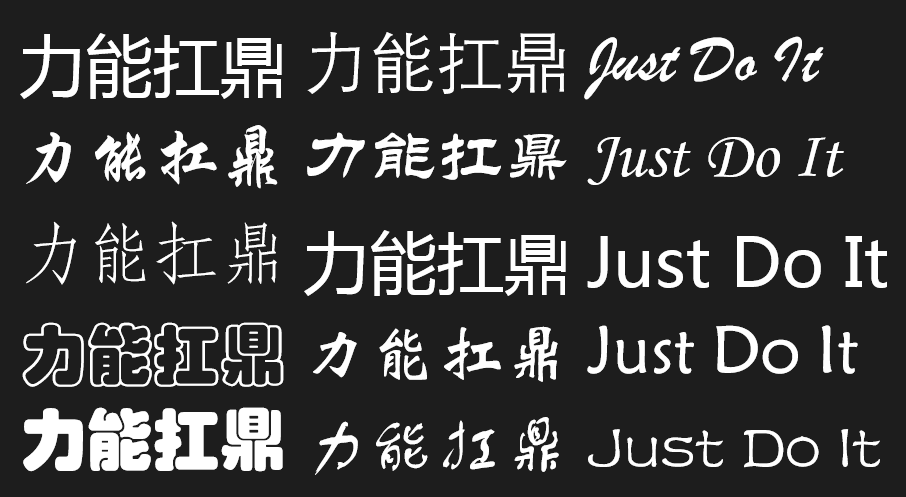
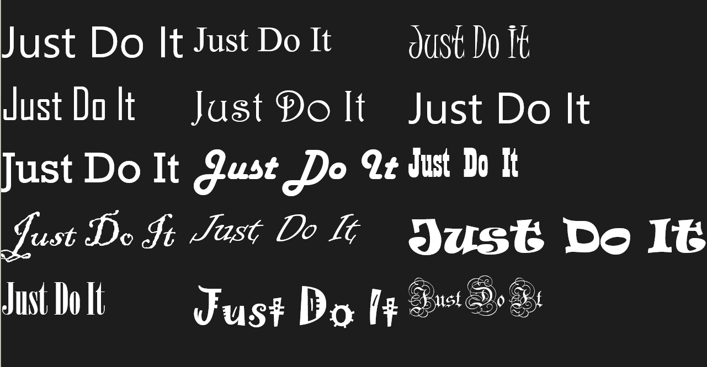
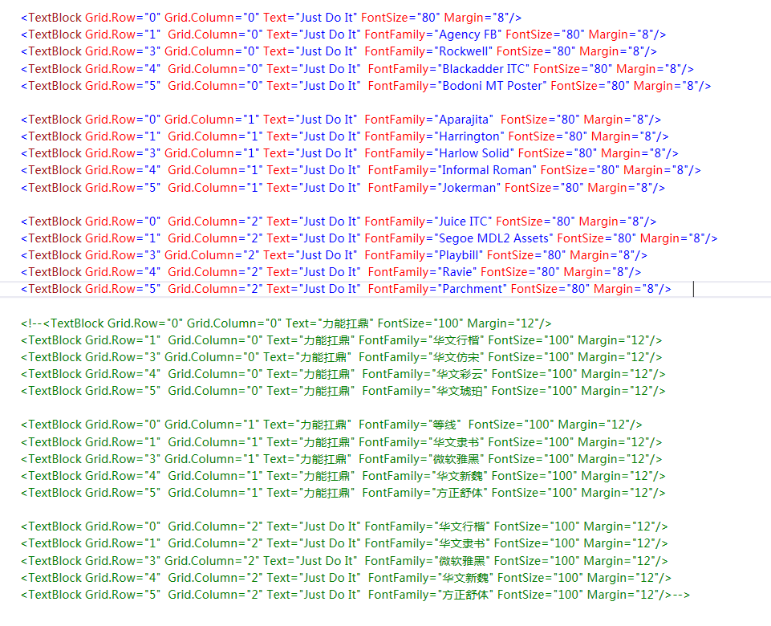
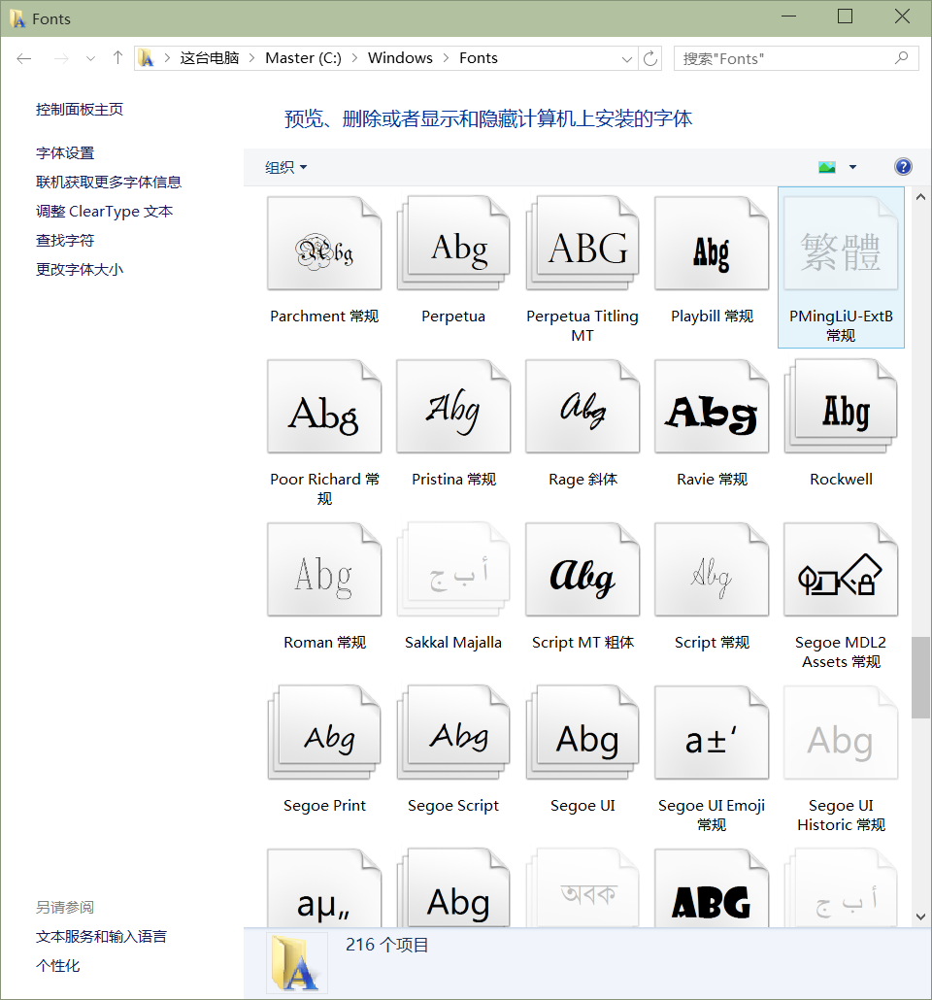
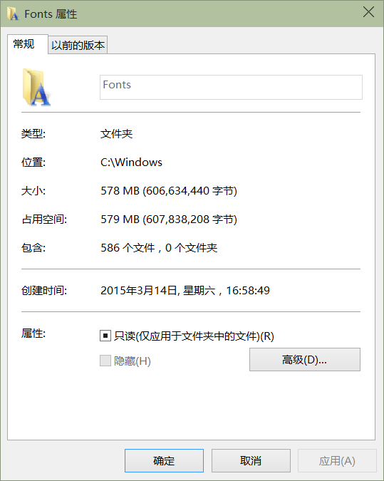

# 使用华丽丽的字体

所有的 TextBlock 等都用的默认字体，大家是否会感觉很千篇一律很枯燥呢？对于 FontFamily，我们见过一些可以用的字体，但这个属性不像 Foreground 等有下拉框，所以我们在应用中见过的许多有意思的字体却没法用，因为不知道名字。

代码的话也贴张图示意一下吧。

好了，我就不再多说废话啦，名字都是从这里来的——>>>>>

注意：
1）除了微软雅黑外，大部分字体只能在 Windows 8/8.1/10 上体现出来，在 WP8/8.1 上无法发挥作用。这是因为这个字体库太大，微软没有放到手机上。

2）大部分中文字体可以作用在英文文本上，而英文字体则无法作用在中文文本上。（经验之谈，如果特例，请告知，谢谢。）