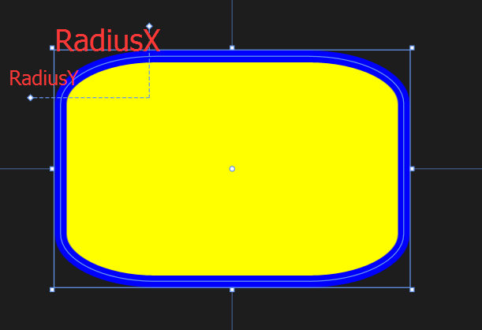
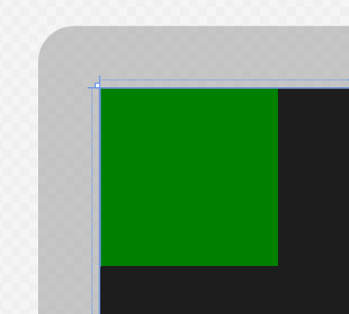
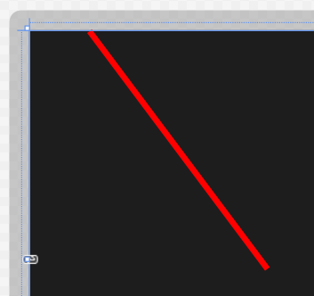
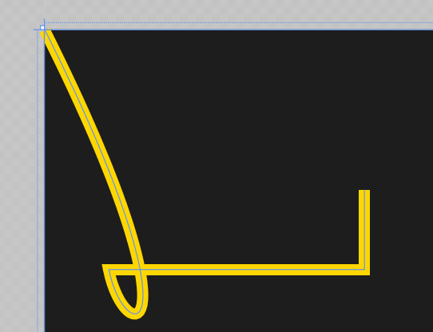
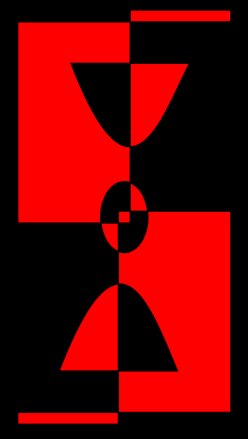
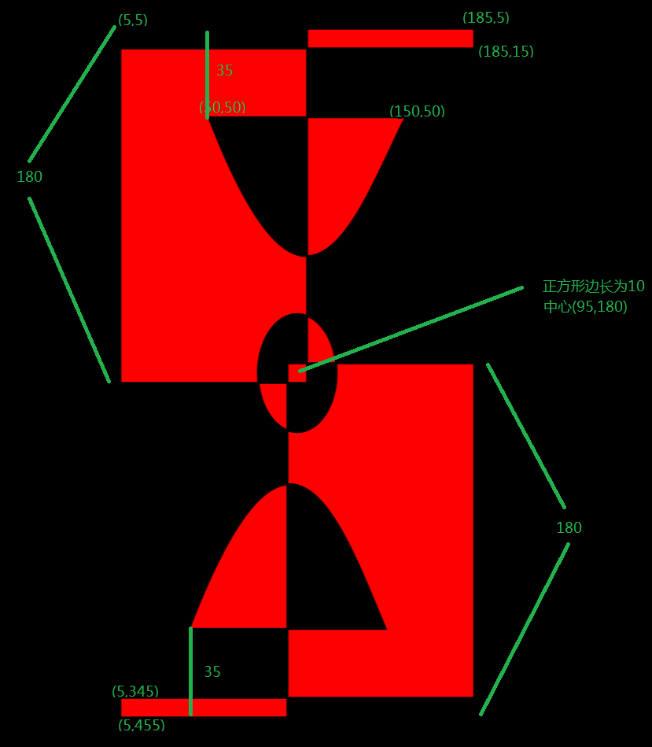

# 绘制图形

## Rectangle

我们开篇先介绍一个之前用过，也是比较简单的 Rectangle。简单的矩形就只用定义长和宽了，但如果要有圆角的话呢，用 RadiusX 和 RadiusY 就好。那么 RadiusX 和 RadiusY 到底是什么呢？看看下图就知道了。

```
<Rectangle Fill="Yellow" Width="300" Height="200" Stroke="Blue"
                   StrokeThickness="10" RadiusX="80" RadiusY="40"/>
```



和 Rectangle 类似，Border 也可以创建矩形，而且后者还可以有自对象以及会自动调整大小，前者只能有固定的大小哦。

## Ellipse

看到这个名字大家应该都知道是什么意思吧，如果要定义成圆的话让 Height 和 Width 属性相等即可。

那童鞋们都知道 ProgressRing 是由 6 个 Ellipse 组成的吗，RadioButton 也是由 2 个同心的 Ellipse 组成的哦。

```
<Ellipse Fill="Blue" Height="200" Width="350"/>
```

## Polygon

Polygon 则显得比较自由，只需要定义出各个顶点，它就会将这些点连接起来。那么我们可能会有疑问，需不需要确定图形的起始点和终点呢？答案是不用的，因为 Polygon 会自动将终点和起始点连接起来（它会假设图形是闭合的）。

```
<Polygon Fill="Green" Points="0,0,100,0,100,100,0,100  "/>
```



如果要在后台 C# 文件中来写的话呢，原本的 Point 则由 PointCollection 来定义所有点后添加到一起。

## Line

Line 的使用也比较简单，但有一点要注意，必须设置好 Stroke 和 StrokeThickness 的属性值，否则 Line 就不会显示出来。原因很简单，因为它是直线。

```
<Line Stroke="Red" StrokeThickness="10" X1="100" Y1="0" Y2="400" X2="400"/>
```



## Path

最后上台的自然是最厉害的啦，先上图。



```
<Path Stroke="Gold"  StrokeThickness="7" 
              Data="M 0,0 C 100,200 50,200 40,150 H 200 V 100 "/>
```

前两个属性用过多次了，Data 却还挺复杂的。这里有 3 个命令，M、C、H 和 V。如果按英文来记可能会容易些吧，分别是：Move、Control、Horizontal 和 Vertical。

那么，重头戏来了，先看图^_^



接着上代码。

```
  <Path Stroke="Black" StrokeThickness="1" Fill="red">
                <Path.Data>
                    <GeometryGroup>           
                        <RectangleGeometry Rect="5,5 180,10" />
                        <RectangleGeometry Rect="5,5 95,180" />  
                        <RectangleGeometry Rect="90,175 95,180"/>   
                        <RectangleGeometry Rect="5,345 180,10" />    
                        <EllipseGeometry            
                            Center="95, 180" RadiusX="20"   
                            RadiusY="30"/>                         
                        <PathGeometry>
                            <PathGeometry.Figures>
                                <PathFigureCollection>
                                    <PathFigure IsClosed="true" StartPoint="50,50">
                                        <PathFigure.Segments>
                                            <PathSegmentCollection>
                                               <BezierSegment Point1="100,180" 
                                                Point2="125,100" Point3="150,50"/>                                                
                                            </PathSegmentCollection>
                                        </PathFigure.Segments>
                                    </PathFigure>                                     
                                    <PathFigure IsClosed="true" StartPoint="40,310">
                                        <PathFigure.Segments>
                                            <PathSegmentCollection>
                                               <BezierSegment Point1="90,180"  
                                               Point2="115,250"Point3="140,310"/>  
                                            </PathSegmentCollection>
                                        </PathFigure.Segments>
                                    </PathFigure>
                                </PathFigureCollection>
                            </PathGeometry.Figures>
                        </PathGeometry>                  
                    </GeometryGroup>
                </Path.Data>
            </Path>  
```
这张图花了我好久时间呢，希望大家也都会画，虽然作用不大，不过花着玩玩也不错。



我在图上大概加了一些标注啦，另外 RectangleGeometry 的 Rect 属性有 2 个值，后者是相对于前者增加的长度哦。

最难的部分是 BezierSegment，也就是贝赛斯曲线，其中 StartPoint 和 Point3 分别为起点和终点，而 Point1 和 Point2 不是路径哟，只是给曲线的一个参考偏移方向。具体大家可以上维基百科看看。