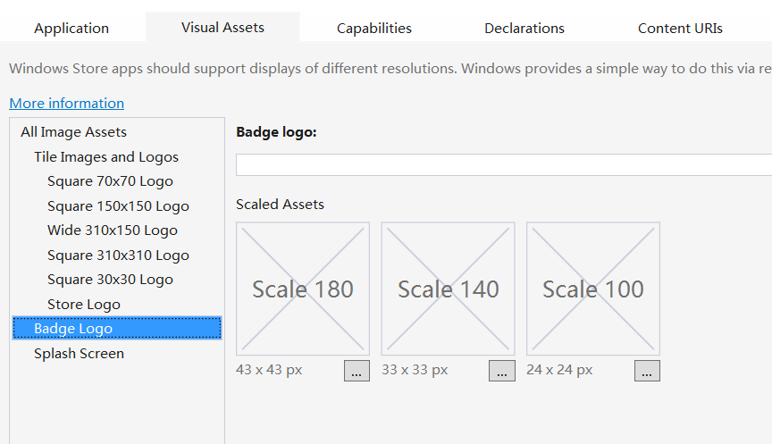

# 使用动态磁贴示例

动态磁贴是什么，相信大家用了这么久的 Windows 8/8.1/10 早就非常了解了吧。

像什么小磁贴、中磁贴、宽磁贴、大磁贴，还有这里的应用商店 Logo 等，大家在下面根据不同的分辨率选择合适的图片就好啦。



下面来做一个更新磁贴页面的功能，这是页面 XML 部分。

```
<StackPanel Margin="12">
  <StackPanel Orientation="Horizontal">
	  <TextBlock FontSize="28" Text="选择模板：" VerticalAlignment="Center"/>
	  <ComboBox x:Name="comboBoxTile"  Width="400" SelectionChanged="comboBoxTile_SelectionChanged"/>
  </StackPanel>
	  <TextBox x:Name="textBoxXML" TextWrapping="Wrap" FontSize="22" Header="XML文档"  
      Width="420" Height="320" HorizontalAlignment="Left" Margin="12"/>
  <Button Name="btnTile"  Content="更新磁贴" Click="btnTile_Click" Style="{StaticResource StyleToastButton}"/>
</StackPanel>
```

在后台代码的 Main 函数中，获取 TileTemplateType 枚举并绑定到 ComboBox 上。

```
var itemsTile = Enum.GetNames(typeof(TileTemplateType));
this.comboBoxTile.ItemsSource = itemsTile;
```

下面的代码和前面的 Toast 真的非常类似，所以我才把这两节连在一起来写了。Button 按钮的 Click 事件中，和之前一样建一个 XML，然后加载到 TileNotification 类的实例中。最后就是 TileUpdateManager 类，也就是磁贴更新。

```
private void btnTile_Click(object sender, RoutedEventArgs e)
{
    if (this.textBoxXML.Text == "")
          return;
    XmlDocument xdoc = new XmlDocument();
    xdoc.LoadXml(this.textBoxXML.Text);
    TileNotification tileNotifi = new TileNotification(xdoc);
    TileUpdateManager.CreateTileUpdaterForApplication().Update(tileNotifi);
}
private void comboBoxTile_SelectionChanged(object sender, SelectionChangedEventArgs e)
{
    TileTemplateType tileTemplate = (TileTemplateType)Enum.Parse(typeof(TileTemplateType),
        this.comboBoxTile.SelectedItem as string);
    XmlDocument xdoc = TileUpdateManager.GetTemplateContent(tileTemplate);
    this.textBoxXML.Text = xdoc.GetXml();
}
```

当然了，如果你的 APP 不满足于一个磁贴，你也可以创建第二个磁贴哟！

依旧和 Toast 通知的 XML 类似，它也有好多属性的……

- Arguments：使用该字符串参数在通过次要磁贴启动应用程序时会传递给 Application 类的 OnLaunched 方法，这样一来应用程序就可以根据传入的参数来执行特定的操作。

- BackgroundColor：设置磁贴的背景色。

- DisplayName和ShortName：设置显示在磁贴上的文本。

- Logo等：设置磁贴的图标，用 Uri。

- ForegroundText：磁贴上文本的颜色，可用的选项有深色、浅色等。

- TileID：设置磁贴的唯一标识 ID，创建新磁贴前用 `SecondaryTile.Exists` 判断是否已经存在。

在添加第二磁贴的 Button 的 Click 事件中：

```
private async void btnCreateTile(object sender, RoutedEventArgs e)
{
	if(SecondaryTile.Exists(textTileID.Text))
	{
		textBlockMsg.Text="该ID磁贴已经存在";
		return ;
	}
	Uri uriImg=new Uri("ms-appx:///Assests/uriImg.png");
	……
	……
	// 创建第二磁贴
	SecondaryTile secTile=new SecondaryTile();
	this.Tag=secTile;
	secTile.DisplayName=textBlockDisplayName.Text;
	secTile.TileID=textBlockID.Text;
	secTile.Arguments="second"; // 在后面有用到
    // 设置图标
    secTile.VisualElements.BackgroundColor=Windows.UI.Colors.Gold;
    ……
    ……
    bool r=await secTile.RequestCreateAsync();
    textBlockMsg.Text=r == true ?"磁贴创建成功啦.":"磁贴创建失败了哎.";  // 返回测试结果
```

如果希望点击第二磁贴导航到特定的页面，就需要重写该页面的 OnNavigatedTo 方法。

```
preteced async override void OnNavigatedTo(NavigationEventArgs e)
{
	if(e.Parameter is Windows.ApplicationModel.Activation.LaunchActivatedEventArgs)
	{
		var arg=e.Parameter as Windows.ApplicationModel.Activation.LaunchActivateEventArgs;
		……
	}
}
if(rootFrame.Content==null)
{
	if(e.Arguments=="second")
		rootFrame.Navigate(typeof(OtherPage),e);
	else
		rootFrame.Navigate(typeof(MainPage));
}
```

这里的参数"second"就是上面设置那个 Arguments 哦，它的作用就在于这里呢。