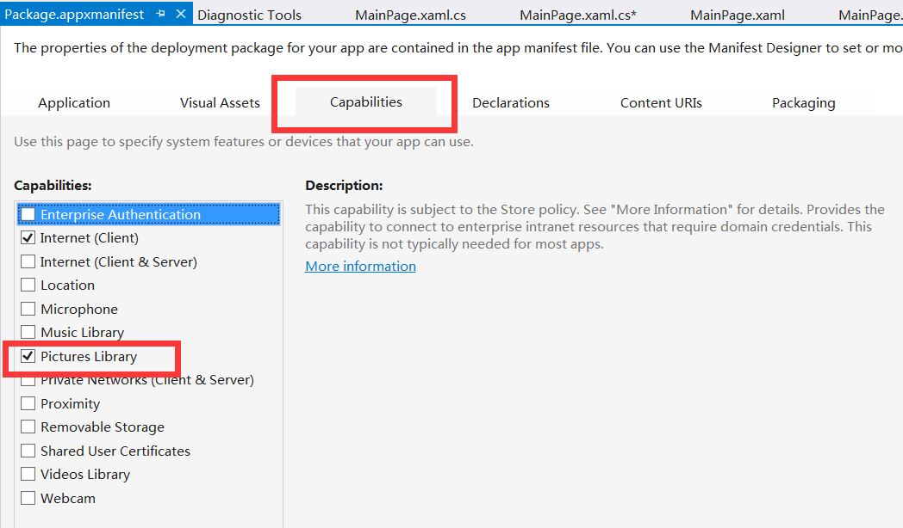

# 读取文件和文件夹名

这一节开始我们将陆续看到 Windows App 是怎样操作文件的。

## 在 Windows 上读取文件名、文件夹名

首先我们在 XAML 中定义一个 Button 和 TextBlock，将读取文件/文件夹名的过程写在前者的 click 事件中，后者则用来显示文件信息。

```
<Grid Background="{ThemeResource ApplicationPageBackgroundThemeBrush}">        
     <StackPanel Orientation="Horizontal">                
          <Button Name="btnGetName" Width="200" Height="100" Content="读取文件名" Click="btnGetName_Click"/>                
          <TextBlock Name="textBlockFileName" Width="500" Height="300" FontSize="30" Margin="12"/>              
     </StackPanel>         
</Grid>
```

以下这段代码，首先通过 StorageFolder 类读取图片库，然后使用异步的方式将图片库的文件和文件夹信息载入相应的 List 中。新建一个 StringBuilder 用以保存这些文件的信息，在这里只是使用了文件/文件夹的 Name 属性，但属性还有很多，比如 Path 属性。最后再将这些获取到的信息赋值给 TextBlock 即可。

```
        private async void btnGetName_Click(object sender, RoutedEventArgs e)
        {
            StorageFolder pictureFolder = KnownFolders.PicturesLibrary;
            IReadOnlyList<StorageFile> pictureFileList = await pictureFolder.GetFilesAsync();
            IReadOnlyList<StorageFolder> pictureFolderList = await pictureFolder.GetFoldersAsync();
            StringBuilder picutreFolderInfo = new StringBuilder();          
            foreach(StorageFile f in pictureFileList)
            {
                picutreFolderInfo.Append(f.Name+"\n");
            }
            foreach(StorageFolder f in pictureFolderList)
            {
                picutreFolderInfo.Append(f.Name+"\n");
            }
            textBlockFileName.Text = picutreFolderInfo.ToString();                
        }
```

注意要在方法名前面加上 async 哦。还有要在清单文件中声明我们的应用要使用图片库哦，一会在 Windows Phone 中也一样。



## 在 Windows Phone 上读取文件名、文件夹名

后台代码不用做任何修改，只需把 XAML 代码修改修改以适应屏幕即可。

    <Grid>
    <StackPanel Orientation="Vertical">
     <Button Name="btnGetName" Width="150" Height="70" HorizontalAlignment="Center"
    Content="读取文件名" Click="btnGetName_Click"/>
     <TextBlock Name="textBlockFileName" Width="300" Height="300" FontSize="30" Margin="12" TextWrapping="Wrap"/>
    </StackPanel>   
    </Grid>

## 读取文件名的其他方法

```
        private async void btnGetName_Click(object sender, RoutedEventArgs e)
        {
            StorageFolder picutureFolder = KnownFolders.PicturesLibrary;
            StringBuilder pictureFolderInfo = new StringBuilder();
            IReadOnlyList<IStorageItem> pictureFileItem = await picutureFolder.GetItemsAsync();              
            foreach(var i in pictureFileItem)
            {
                if (i is StorageFolder)
                    pictureFolderInfo.Append(i.Name + "\n");
                else
                    pictureFolderInfo.Append(i.Name + "\n");
            }    
            textBlockFileName.Text = pictureFolderInfo.ToString();
        }
```