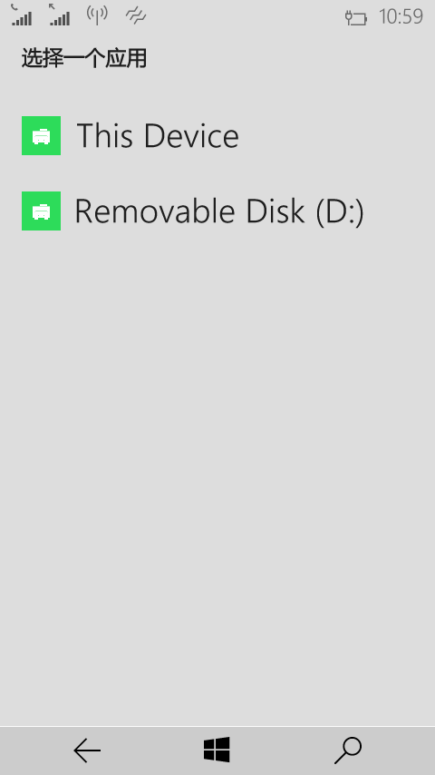
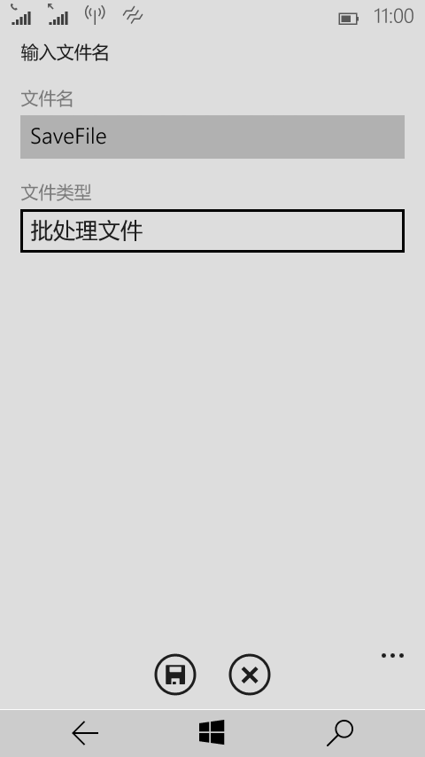
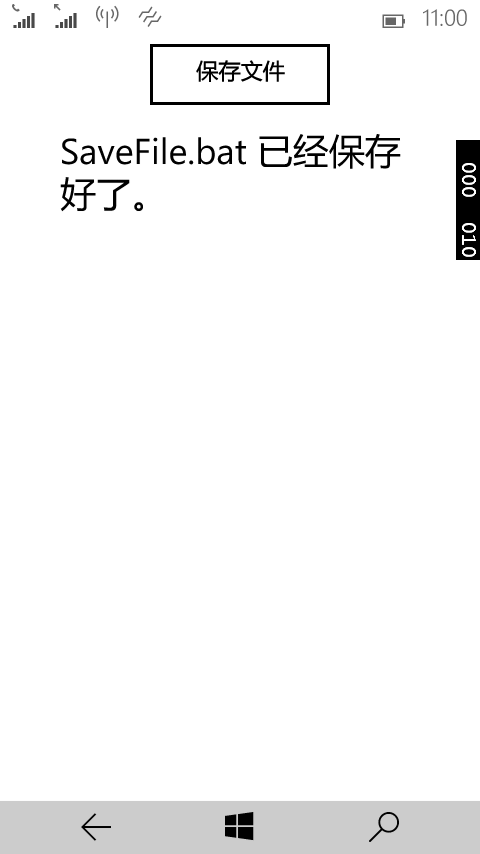
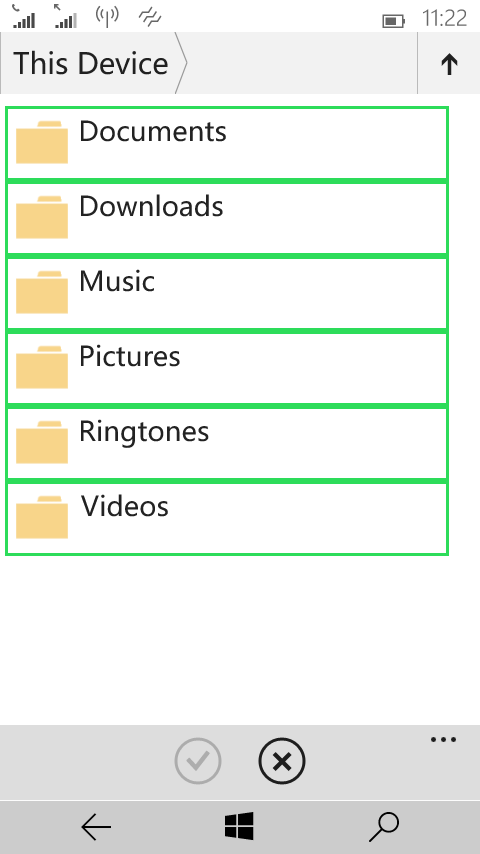

# 文件选取器

## 使用文件选取器保存文件

就我个人而言，还是非常喜欢使用文件选取器的，因为能够用自己的代码来调用系统的各种弹框。

在这个示例中，首先在 XAML 中添加一个 Button 和一个 TextBlock，分别命名为 btnSaveFile 和 tBlockSaveInfo。对于这个保存文件这个操作在后台的 Click 事件中就可以轻易完成了。

```
private async void btnSaveFile_Click(object sender, RoutedEventArgs e)
{
      FileSavePicker saveFile = new FileSavePicker();
      saveFile.SuggestedStartLocation = PickerLocationId.DocumentsLibrary;         
      // 显示在下拉列表的文件类型
      saveFile.FileTypeChoices.Add("批处理文件", new List<string>() { ".bat" });        
      // 默认的文件名
      saveFile.SuggestedFileName = "SaveFile";
      StorageFile file = await saveFile.PickSaveFileAsync();
      if(file!=null)
      {
           // 在用户完成更改并调用CompleteUpdatesAsync之前，阻止对文件的更新
           CachedFileManager.DeferUpdates(file);
           string fileContent = "@echo off \n dir/s \n  pause";
           await FileIO.WriteTextAsync(file, fileContent);
           // 当完成更改时，其他应用程序才可以对该文件进行更改。
           FileUpdateStatus updateStatus = await CachedFileManager.CompleteUpdatesAsync(file);
           if(updateStatus==FileUpdateStatus.Complete)
           {
               tBlockSaveInfo.Text = file.Name + " 已经保存好了。";
           }
           else
           {
               tBlockSaveInfo.Text = file.Name + " 保存失败了。";
           }                                                                                    
      }
      else
      {
           tBlockSaveInfo.Text = "保存操作被取消。";
      }
}
```

代码中的下拉列表的文件类型就是如下所示这个样子哟。


大部分的内容我都已经通过注释的方式添加到代码中了，至于fileContent的那段代码到底是什么意思，大家试试就知道了，我感觉蛮有意思的。[3行代码列出硬盘上所有文件及文件夹](http://blog.csdn.net/nomasp/article/details/44927037)

如果大家试过打开这个 bat 文件，有没有觉得有趣呢？

更厉害的是，我们刚才所写的代码可以在 Windows Phone 上不经修改而直接使用。我的 Lumia 638 已经刷上了 Windows 10 预览版，大家可以瞧瞧，全新的资源管理器。








## 使用文件选取器打开文件

和用文件选取器保存文件相类似，打开文件的逻辑都差不多。这个示例中同样在 XAML 中定义一个名为 btnOpenFile 的 Button 和一个名为 tBlockOpenInfo 的 TextBlock。

```
private async void btnOpenFile_Click(object sender, RoutedEventArgs e)
{
     FileOpenPicker openFile = new FileOpenPicker();
     openFile.SuggestedStartLocation = PickerLocationId.DocumentsLibrary;
     openFile.ViewMode = PickerViewMode.List;
     openFile.FileTypeFilter.Add(".txt");
     openFile.FileTypeFilter.Add(".docx");
     openFile.FileTypeFilter.Add(".pptx");
     // 选取单个文件
     StorageFile file = await openFile.PickSingleFileAsync();
     if (file != null)
     {
          tBlockOpenInfo.Text = "你所选择的文件是： " + file.Name;
     }
     else
     {
          tBlockOpenInfo.Text = "打开文件操作被取消。";
     }
     // 选择多个文件
     //IReadOnlyList<StorageFile> fileList = await openFile.PickMultipleFilesAsync();
     //StringBuilder fileOpenInfo = new StringBuilder();
     //if(fileList!=null)
     //{
     //    foreach( StorageFile f in fileList)
     //    {
     //        fileOpenInfo.Append(f.Name + "\n");
     //    }
     //    tBlockOpenInfo.Text = "你所选择的文件是： "+"\n"+ fileOpenInfo.ToString();
     //}
     //else
     //{
     //    tBlockOpenInfo.Text = "打开文件操作被取消。";
     //}
}
```

我已经将选取多个文件的代码也列了出来，只需要取消注释即可。像 ViewMode 和 FileTypeFilter 这种属性，看看名字应该都知道了吧。重在实践。

在手机上也是通用的，刚才我试过了，成功进入了资源管理器，不过没能打开文件。应该是因为预览版的原因，这个预览版连 Office 都被移除了，估计会在下一版中添加通用版的 Office 应用。

