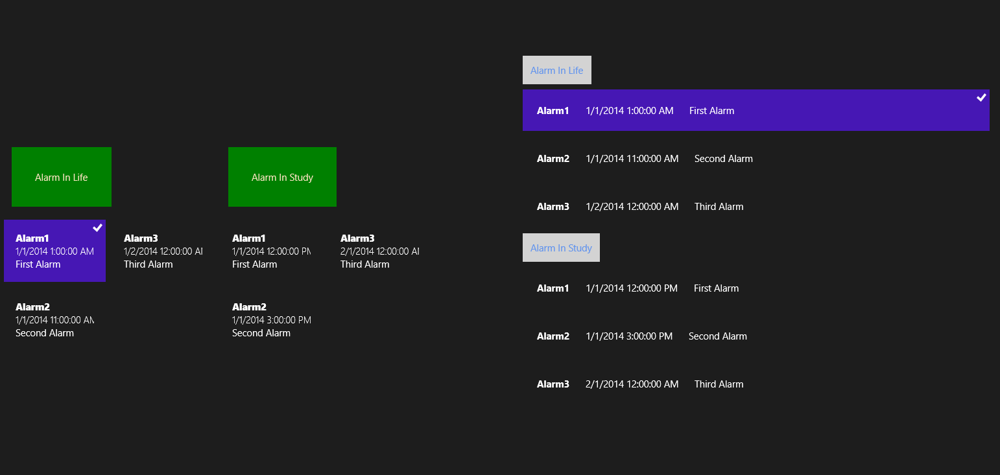

# 为 ListView 和 GridView 添加分组

本文承接“为 ListView 和 GridView 添加数据”。

在上一节中我们已经了解了怎样将数据绑定到 ListView 或 GridView，但既然要用到这两个控件往往是因为数据繁多，那么几乎就不可避免的要让其能够分组。我们所绑定的数据源可能是项列表，其中的每个项甚至还有其自己的项，那么问题就来了。

一时不会也想不出什么宏伟的例子，就做一个简单的闹钟的时间表的 ListView 和 GridView 吧。那么先在项目中添加一个类，最好在 Shared 下。内容都是很简易的，闹钟的标题、时间、备注等，为了增加一级目录就加了一个 AlarmMode，就算作学习和生活吧，学习生活两不误……

```
public class Alarm
{
    public string Title { get; set; }
    public DateTime AlarmClockTime { get; set; }
    public string Description { get; set; }
    public string AlarmMode { get; set; }
}
public class AlarmMode
{
   public AlarmMode()
   {
       alarmMode = new ObservableCollection<Alarm>();
   }
   public string Name { get; set; }
   public ObservableCollection<Alarm> alarmMode { get; private set; }
}
```

首先，先来定义一个全局的时间，然后在页面加载时加载两个函数（将在下一步定义）。

```
DateTime globalTime;
protected override void OnNavigatedTo(NavigationEventArgs e)
{
    DateTime.TryParse("1/1/2115", out globalTime);
    AddAlarm();
    AddAlarmMode();
}
```

一大波数据正在靠近！

```
private void AddAlarm()
{
    List<Alarm> listAlarm = new List<Alarm>();
    listAlarm.Add(new Alarm()
    {
        Title = "Alarm1",
        Description = "First Alarm",
        AlarmClockTime = globalTime.AddHours(1),
        AlarmMode = "Alarm In Life"
    });
    listAlarm.Add(new Alarm()
    {
        Title = "Alarm2",
        Description = "Second Alarm",
        AlarmClockTime = globalTime.AddHours(11),
        AlarmMode = "Alarm In Life"
    });
    listAlarm.Add(new Alarm()
    {
        Title = "Alarm3",
        Description = "Third Alarm",
        AlarmClockTime = globalTime.AddDays(1),
        AlarmMode = "Alarm In Life"
    });
    listAlarm.Add(new Alarm()
    {
        Title = "Alarm1",
        Description = "First Alarm",
        AlarmClockTime = globalTime.AddHours(12),
        AlarmMode = "Alarm In Study"
    });
    listAlarm.Add(new Alarm()
    {
        Title = "Alarm2",
        Description = "Second Alarm",
        AlarmClockTime = globalTime.AddHours(15),
        AlarmMode = "Alarm In Study"
    });
    listAlarm.Add(new Alarm()
    {
        Title = "Alarm3",
        Description = "Third Alarm",
        AlarmClockTime = globalTime.AddMonths(1),
        AlarmMode = "Alarm In Study"
    });
    ar alarmSetting = from ala in listAlarm
                       group ala
                       by ala.AlarmMode
                       into alaSetting
                       orderby alaSetting.Key
                       select alaSetting;
    collectionVSAlarm.Source = alarmSetting;
}
private void AddAlarmMode()
{
    List<AlarmMode> listAlarmMode = new List<AlarmMode>();
    AlarmMode am1 = new AlarmMode();
    am1.Name = "Alarm In Life";
    am1.alarmMode.Add(new Alarm()
    {
        Title = "Alarm1",
        Description = "First Alarm",
        AlarmClockTime = globalTime.AddHours(1),
    });
    am1.alarmMode.Add(new Alarm()
    {
        Title = "Alarm2",
        Description = "Second Alarm",
        AlarmClockTime = globalTime.AddHours(11),
    });
    am1.alarmMode.Add(new Alarm()
    {
        Title = "Alarm3",
        Description = "Third Alarm",
        AlarmClockTime = globalTime.AddDays(1),
    });
    listAlarmMode.Add(am1);
 	AlarmMode am2 = new AlarmMode();
    am2.Name = "Alarm In Study";
    am2.alarmMode.Add(new Alarm()
    {
        Title = "Alarm1",
        Description = "First Alarm",
        AlarmClockTime = globalTime.AddHours(12),
    });
    am2.alarmMode.Add(new Alarm()
    {
        Title = "Alarm2",
        Description = "Second Alarm",
        AlarmClockTime = globalTime.AddHours(15),
    });
    am2.alarmMode.Add(new Alarm()
    {
        Title = "Alarm3",
        Description = "Third Alarm",
        AlarmClockTime = globalTime.AddMonths(1),
    });
    listAlarmMode.Add(am2);
	collectionVSAlarmMode.Source = listAlarmMode;
}
```

这些数据都是乱七八糟啦，大家凑合着看。这是两个函数，数据我都是用 `List<>` 来定义的，将数据通过 Add 函数添加到 listAlarm 和 listAlarmMode 中即可。最后再从 listAlarm 中根据 AlarmMode 挑出数据到 alaSetting，同时还要根据 Key 值进行排序最后选出并连接到collectionVSAlarm的 Source 属性中。这个是需要在 MainPage.xaml 中定义的哦，就像 `<Page.Resource/>` 一样。还需要 ItemsPath 属性来定义其的子对象哟。

```
    <UserControl.Resources>
        <CollectionViewSource x:Name="collectionVSAlarm"     IsSourceGrouped="True"/>
        <CollectionViewSource x:Name="collectionVSAlarmMode"     IsSourceGrouped="True" ItemsPath="alarmMode"/>
    </UserControl.Resources>
```

然后我们还需要创建一个 ListGridGroupStyle 类来继承 GroupStyleSelector，重载它的 SelectGroupStyleCore 方法，并且返回 ListGridGroupStyleResource 资源，这个资源在博客后文中有定义，其定义在 App.xaml 中。相应的代码如下咯：

```
    public class ListGridGroupStyle : GroupStyleSelector
    {
        protected override GroupStyle SelectGroupStyleCore(object group, uint level)
        {
            return (GroupStyle)App.Current.Resources["ListGridGroupStyleResource"];
        }
    }
```

方法重载好之后就需要在前面的 UserControl.Resources 中加上以下这条代码啦。

```
    <local:ListGridGroupStyle x:Key="ListGridGroupStyleResource"/>
```

然后我们来一系列的基本样式到 App.xaml 中就好啦，关于资源文件的使用我们在后面会系统的来学习。这里的 DataTemplate 和 GroupStyle 都在资源字典中，前者是 Template 模板，后者是 Style 风格。内容的排版大家都随意啦，记得设置好 Key 值。

```
    <Application.Resources>
        <ResourceDictionary>
            <DataTemplate x:Key="dataTemplateListView">
                <StackPanel Width="700" Margin="10">
                    <StackPanel Orientation="Horizontal">
                        <TextBlock Text="{Binding Title}" FontWeight="Bold" Margin="12"/>
                        <TextBlock Text="{Binding AlarmClockTime}" TextWrapping="NoWrap" Margin="12"/>
                        <TextBlock Text="{Binding Description}" TextWrapping="NoWrap" Margin="12"/>
                    </StackPanel>             
                </StackPanel>
            </DataTemplate>
            <GroupStyle x:Key="ListGridGroupStyleResource">
                <GroupStyle.HeaderTemplate>
                    <DataTemplate>
                        <Grid Background="LightGray"  >
                            <TextBlock Text='{Binding Key}' Foreground="CornflowerBlue" Margin="12"  />
                        </Grid>
                    </DataTemplate>
                </GroupStyle.HeaderTemplate>
            </GroupStyle>
        </ResourceDictionary>
    </Application.Resources>
```

那么这些各种资源都定义好了之后就在 MainPage.xaml 把下面这些敲进去。各种资源的调用在这里尤其需要注意，其实对于稍微复杂一丁点的程序而言，名称就已经变得让人崩溃了。所以拥有一个良好的命名习惯很重要。

```
    <Grid Background="{ThemeResource ApplicationPageBackgroundThemeBrush}">
        <Grid.ColumnDefinitions>
            <ColumnDefinition Width="auto"/>
            <ColumnDefinition Width="auto"/>
        </Grid.ColumnDefinitions>
        <GridView Grid.Column="0" ItemsSource="{Binding Source={StaticResource collectionVSAlarmMode}}"        
                  Margin="12,120,12,12" MaxHeight="600" >
            <GridView.ItemTemplate>
                <DataTemplate>
                    <StackPanel Margin="18">
                        <TextBlock Text="{Binding Title}" FontWeight="ExtraBold"   />
                        <TextBlock Text="{Binding AlarmClockTime}"  FontWeight="Light" TextWrapping="NoWrap"  />
                        <TextBlock Text="{Binding Description}" TextWrapping="NoWrap"  />
                    </StackPanel>
                </DataTemplate>
            </GridView.ItemTemplate>
            <GridView.ItemsPanel>
                <ItemsPanelTemplate>
                    <ItemsWrapGrid MaximumRowsOrColumns="2"/>
                </ItemsPanelTemplate>
            </GridView.ItemsPanel>
            <GridView.GroupStyle>
                <GroupStyle>
                    <GroupStyle.HeaderTemplate>
                        <DataTemplate>
                            <Grid Background="Green" Margin="12">
                                <TextBlock Text='{Binding Name}' 
                                           Foreground="Bisque" Margin="36"/>
                            </Grid>
                        </DataTemplate>
                    </GroupStyle.HeaderTemplate>    
                </GroupStyle>
            </GridView.GroupStyle>
        </GridView>
        <ListView Grid.Column="1" ItemsSource="{Binding Source={StaticResource collectionVSAlarm}}"     
                  ItemTemplate="{StaticResource dataTemplateListView}"    
                  GroupStyleSelector="{StaticResource ListGridGroupStyleResource}"          
                  Margin="120" />       
    </Grid>
```



我这写的真是太丑了哎，做产品的时候可得好好调调了。
