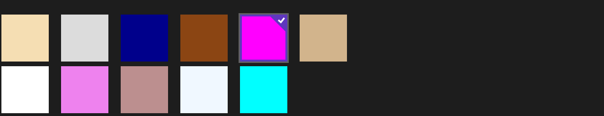

# 为 ListView 和 GridView 添加数据

ListView 采用垂直堆叠得方式显示数据，而 GridView 则采用水平堆叠得方式。

长相的话嘛，它们都差不多。

```
    <Grid Name="grid1" Background="{ThemeResource ApplicationPageBackgroundThemeBrush}">
        <ListView x:Name="listView1" SelectionChanged="listView1_SelectionChanged">
            <x:String>Item 1</x:String>
            <x:String>Item 2</x:String>
        </ListView>
        <GridView x:Name="gridView1" SelectionChanged="gridView1_SelectionChanged">
            <x:String>Item 1</x:String>
            <x:String>Item 2</x:String>
        </GridView>
    </Grid>
```

当然，也可以在后台代码上添加。我只是为了将它们放在一起比较而已，这些代码堆一起肯定是很丑的。

```
ListView listView1 = new ListView();
listView1.Items.Add("Item 1");
listView1.Items.Add("Item 2");
listView1.Items.Add("Item 3");
listView1.SelectionChanged += listView1_SelectionChanged;           
grid1.Children.Add(listView1);        
```

```
GridView gridView1 = new GridView();
gridView1.Items.Add("Item 1");
gridView1.Items.Add("Item 2");
gridView1.SelectionChanged += gridView1_SelectionChanged;                                                                                                                        
grid1.Children.Add(gridView1);               
```

如果只是像上面这样来添加内容会不会比较麻烦呢，我们也可以把这些 Item 1、Item 2 之类的全部放在 List 中。

```
List<String> itemsList = new List<string>();
itemsList.Add("Item 1");
itemsList.Add("Item 2");
ListView listView1 = new ListView();
listView1.ItemsSource = itemsList;
listView1.SelectionChanged += listView1_SelectionChanged;
grid1.Children.Add(listView1);
```

这样一来所显示的 ListView 就是两行，非常简陋，完全不能够满足要求。那么我们可以用它的 ItemTemplate 属性来再里面添加一些东西，如下所示，我们可以在 Grid 中写一个 Image 绑定头像，用 TextBlock 绑定用户的ID，再来一个 TextBlock 绑定用户的消息，还可以来写边框呀什么的。而这些乱七八糟的 Binding 之类的，以后我们也会一起讲的哦，现在只要它们是数据绑定就好。

```
<Page.Resources>
    <CollectionViewSource x:Name="collectionVS" Source="{Binding Items}"/>
</Page.Resources> 
<Grid Name="grid1" Background="{ThemeResource ApplicationPageBackgroundThemeBrush}">
    <ListView x:Name="listView1"  ItemsSource="{Binding Source={StaticResource collectionVS}}"
      SelectionChanged="listView1_SelectionChanged">
        <ListView.ItemTemplate>
            <DataTemplate>
                <Grid>
                </Grid>
            </DataTemplate>
        </ListView.ItemTemplate>
    </ListView>      
</Grid>
```

还可以像下面这样哦，通过 WrapGrid 来决定这些 Item 的摆放方式。



```
<Grid Name="grid1" Background="{ThemeResource ApplicationPageBackgroundThemeBrush}">
   <ListView VerticalAlignment="Bottom">          
        <ListView.ItemsPanel>
            <ItemsPanelTemplate>
                <WrapGrid Orientation="Vertical" MaximumRowsOrColumns="2"/>
            </ItemsPanelTemplate>
        </ListView.ItemsPanel>
        <Rectangle Height="100" Width="100" Fill="Wheat" />
        <Rectangle Height="100" Width="100" Fill="White" />
        <Rectangle Height="100" Width="100" Fill="Gainsboro" />
        <Rectangle Height="100" Width="100" Fill="Violet" />
        <Rectangle Height="100" Width="100" Fill="DarkBlue" />
        <Rectangle Height="100" Width="100" Fill="RosyBrown" />
        <Rectangle Height="100" Width="100" Fill="SaddleBrown" />
        <Rectangle Height="100" Width="100" Fill="AliceBlue" />
        <Rectangle Height="100" Width="100" Fill="Fuchsia" />
        <Rectangle Height="100" Width="100" Fill="Aqua" />
        <Rectangle Height="100" Width="100" Fill="Tan" />
    </ListView>
</Grid>
```

当然啦，对于 ListView 和 GridView 而言，知道用户选择了哪一项是很重要的。SelectionMode 属性决定了 ListView 和 GridView 的选择模式：单个、多个、无、扩展。

下面这个函数将选择的项给了 selectedItems 啦。我们还可以通过 IsItemClickEnabled 来启用 ListView 和 GridView 的点击事件，但是务必要注意将 SelectionMode 设置为 None。

```
private void listView1_SelectionChanged(object sender, SelectionChangedEventArgs e)
{
     selectedItems = (List<object>)e.AddedItems;   
}    
```