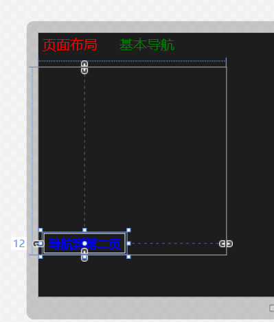
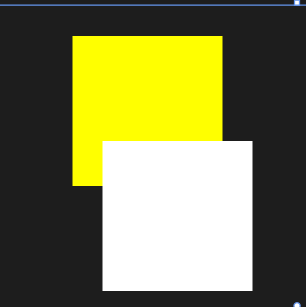
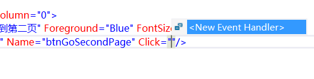
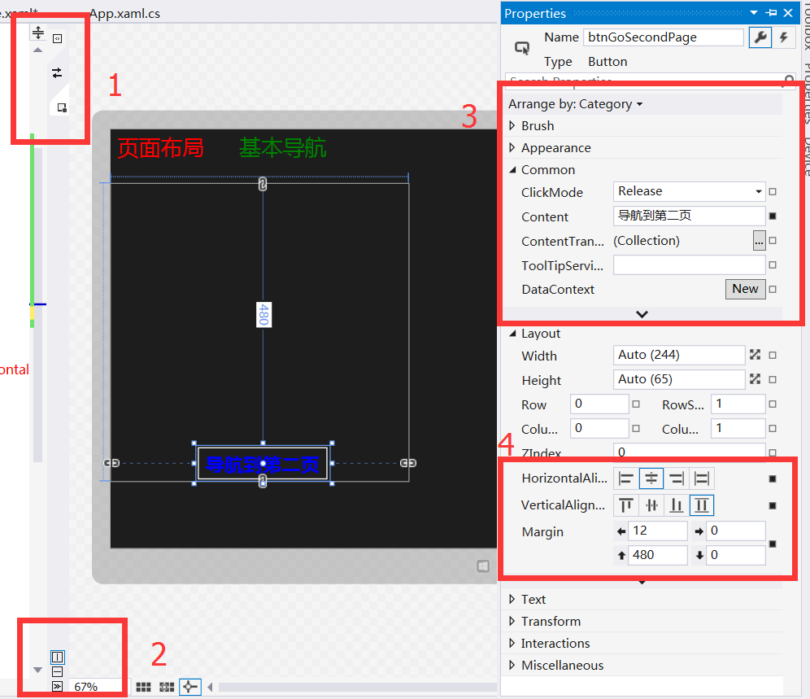
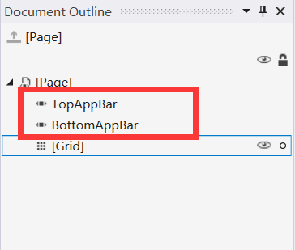
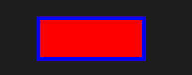

# 页面布局与基本导航

## 简单示例看页面布局和导航

首先按照上一篇博客中的顺序来新建一个项目。新建好之后就点开 MainPage.xaml 开始敲代码了。

```
<Grid Background="{ThemeResource ApplicationPageBackgroundThemeBrush}">
        <Grid.RowDefinitions>
            <RowDefinition Height="100"/>
            <RowDefinition Height="auto"/>
            <RowDefinition Height="*"/>
        </Grid.RowDefinitions>
        <Grid.ColumnDefinitions>
            <ColumnDefinition Width="4*"/>
            <ColumnDefinition Width="6*"/>
        </Grid.ColumnDefinitions>
        <StackPanel Grid.Row="0" Grid.ColumnSpan="2" Orientation="Horizontal">
            <TextBlock Text="页面布局" Foreground="Red" FontSize="40" Margin="12" 
                     Width="200" Height="80" />
            <TextBlock Text="基本导航" Foreground="Green" FontSize="40" Margin="12" 
                       Width="200" Height="80"  />
        </StackPanel>
        <Grid Grid.Row="1" Grid.Column="0">
            <Button Content="导航到第二页" Foreground="Blue" FontSize="35"
                   Margin="12,480,0,0" Name="btnGoSecondPage" Click="btnGoSecondPage_Click"/>
        </Grid>   
        <Canvas Grid.Row="1" Grid.Column="1" HorizontalAlignment="Center" VerticalAlignment="Center">
             <Rectangle Fill="Blue"/>
             <Rectangle Fill="Yellow" Height="100" Width="100" Canvas.Left="50" Canvas.Top="20"/>
             <Rectangle Fill="White" Height="100" Width="100" Canvas.Left="70" Canvas.Top="90"/>
        </Canvas>        
    </Grid>
```

下面就来依次介绍上面这段代码到底做了写什么。

1）首先将最外围的 Grid 控件分成了3行2列。其中第一行的高度是 100 像素；第二行的高度是自动的，所谓自动呢，就是会根据将来在其中添加的控件的所占的高度来决定的；第三行的高度就是剩余的啦，这么说可能不够清楚到底星号是什么意思。那再看看切成的这两列就好啦，它的宽度比就是 4：6。很显然不一定是非得比例加起来等于10，即便是 4：100 也可以的。

2）在最外层的 Grid 内嵌套了一个 StackPanel，并且将其定位在第一行，而且横跨 2 列。Grid 最擅长的就是操作具体的像素，它可以将任何控件精确的定位到任何一点。而 StackPanel 最重要的 Orientation 属性则可以安排其内的控件的排列方式，比如这里就是让两个 TextBlock 控件按水平方向来排列。

3）在这里又嵌套了 Grid，里面有一个 Button，Foreground 属性是定义字体颜色，FontSize 属性是定义字体大小。下面重点来看看 Margin 属性。我们定义的 Marin="12,480,0,0"，从左至右依次是左、上、右和下四个方向距离外围边框的距离。



在设计器中已经标注了左边距是 12，而上边距没有体现出来，但确实是 480。还记得之前的那个 auto 么，在这里就体现出来了啦，因为下边距是 0，所以 Grid 的分割线就刚好在 Button 下面啦。但为什么右边的分割线不刚好在Button 的右边呢，这是因为我们之前的 2 列是按照 4：6 的比例来切的呀，而不是设置的 auto。

4）Canvas 位于其外围的 Grid 控件的正中央，HorizontalAligment 和 VerticalAlignment 分别表示水平方向和垂直方向的摆放位置。Canvas.Top 和 Canvas.Left 分别表示离 Canvas 最上边和最下边的距离。



5）给Button设置一个名字，然后敲下 Click="" 之后，就会出现如下图所示，这是直接按下 Enter 键就可以直接命名咯。小技巧啦。



然后双击 Click 事件的名字后，直接按 F12 键就会自动生成一个事件并且跳转到 C# 文件啦。下面这段代码就是会让页面从 MainPage 跳转到 SecondPage。

```
private void btnGoSecondPage_Click(object sender, RoutedEventArgs e)
{    
  if (this.Frame != null)
  {
     this.Frame.Navigate(typeof(SecondPage));
  }
}
```
写完这段代码也先别急着调试，因为还没有创建 SecondPage 呢。建议创建好之后最好再往里面加点东西，不然跳转过去了就是黑茫茫的一片还以为是出 Bug 了呢，添加一个基本的 TextBlock 就可以了。

```
   <TextBlock Text="Second Page" FontSize=" 50"/>
```

我再来简单介绍一下 VS 中常用的一些东西，仅仅面向初学者。在下面的图中，方框 1 处可以让设计器和 XAML 代码的位置对换哦，截图里我就是将设计器放到了右边，不过只是为了截图，设计器还是在左边比较习惯。

方框 2 处可以让设计器和 XAML 代码上下摆列和左右摆列也可以不显示它们中的某一个。旁边还可以设置网格对齐以及设计器的缩放比例。

方框 3 和方框 4 中可以设置的东西就太多啦，可以设置渐变色，也可以设置 Click 事件，还可以设置控件的布局等。



## 应用栏布局

Windows 上的 modern 应用我倒是不常用，不过 WP8 上的应用我觉得和安卓什么的最大的区别就是它的应用栏了，下面就来讲讲应用栏是怎么做出来的。

在 Document Outline（在视图中找到，或者按 Ctrl+W，U）中有 TopAppBar 和 BottomAppBar，分别是顶部和底部的应用栏。点鼠标右键可以快速定义 AppBar 和 CommandBar，通常将 AppBar 放在应用上端也就是 TopAppBar 内，CommandBar 放在下端也就是 BottomAppBar 内。



或许很多人都不知道，在 Modern 应用下，按 Win+Z 键可以直接呼出应用栏哟。另外要注意 AppBar 与 CommandBar 不同，前者只能包含一条子内容，通常定义一个 Grid 控件，然后在 Grid 内嵌套其他控件。下面贴出一段 AppBar 的示例：

```
<Page.TopAppBar>
  <AppBar IsSticky="True">
     <Grid>
       <Grid.ColumnDefinitions>
          <ColumnDefinition/>
          <ColumnDefinition/>
       </Grid.ColumnDefinitions>
       <StackPanel Orientation="Horizontal">
          <Button Content="Main Page" Width="140" Height="80" Click="AppBarButton1_Click"/>
          <Button Content="Second Page" Width="140" Height="80" Click="AppBarButton2_Click"/>
          <Button Content="Third Page" Width="140" Height="80" Click="AppBarButton3_Click"/>
          <TextBlock Text="AppBar" Foreground="Red" FontSize="40"  
          VerticalAlignment="Center" Margin="12" Width="200"/>
       </StackPanel>                   
       <SearchBox Grid.Column="1" Width="300" Height="50" HorizontalAlignment="Right"/>
    </Grid>
  </AppBar>
</Page.TopAppBar>    
<Page.BottomAppBar>
    <CommandBar>
       <AppBarButton Label="Refresh" Icon="Refresh"  
           Click="appBarBtn4_Click"/>
       <AppBarButton Label="Redo" Icon="Redo"
           Click="appBarBtn5_Click"/>        
       <CommandBar.SecondaryCommands>
          <AppBarButton Label="Add" Icon="Add" Click="AppBarButton6_Click"/>
          <AppBarButton Label="Delete" Icon="Delete" Click="AppBarButton7_Click"/>
          <AppBarButton Label="Edit" Icon="Edit" Click="AppBarButton8_Click"/>
       </CommandBar.SecondaryCommands>                                     
   </CommandBar>
</Page.BottomAppBar>
```

但是大家应该都发现了，默认情况下应用栏是隐藏起来的，如果想要在加载的时候就是启动的，那该怎么办呢？很简单，直接在 AppBar 定义 IsOpen 属性为真就好。

```
<CommandBar IsOpen="True">
	<!-- -->
</CommandBar>
```

另外还有粘滞属性哟。也就是说，原本当用右键呼出应用栏后，再用左键等点一下其他位置应用栏就会自己消失啦，但如果 IsSticky 属性为真的话呢，非得再多按几下右键才会消失的。

```
<AppBar IsSticky="True">
	<!-- -->
</AppBar>
```

除了在 XAML 中定义这些属性外，我们也可以在后台代码中用函数来实现呢，这里我就是用的 2 个 Button 的 Click 事件。

```
private void btnSetAppBar_Click(object sender, RoutedEventArgs e)
{
   if (this.TopAppBar != null)
   {
       this.TopAppBar.IsSticky = true;
   }
}
private void btnSetAppBar2_Click(object sender, RoutedEventArgs e)
{
    if (BottomAppBar.IsOpen ==false)
    {
       this.BottomAppBar.IsOpen = true;
    }
}
```

既然是通用应用了，那么 WP 这边自然也是类似的，不过暂时还只有 BottomAppBar 却没有 TopAppBar 呢，以下是系统给生成的代码，和 Windows 上的一样。

```
    <Page.BottomAppBar>
        <CommandBar>
            <AppBarButton Icon="Accept" Label="appbarbutton"/>
            <AppBarButton Icon="Cancel" Label="appbarbutton"/>
        </CommandBar>
    </Page.BottomAppBar>
```

想要了解更多关于应用栏的内容，大家可以看这里哟：[【万里征程——Windows App开发】应用栏](http://blog.csdn.net/nomasp/article/details/44872097)。

## 常用属性

- Background：背景色
- BorderBrush：边框色
- BorderThickness：边框大小

```
  <Button Background="Red" BorderBrush="Blue" BorderThickness="5" Height="66" Width="153"/>
```



ClickMode：点击模式，具体有 3 种：悬停（Hover）、按压（Press）、释放（Release）

- Content：内容
- FontFamily：字体
- FontSize：字体大小
- Foreground：字体颜色
- FontStretch：字体在屏幕上的展开程度