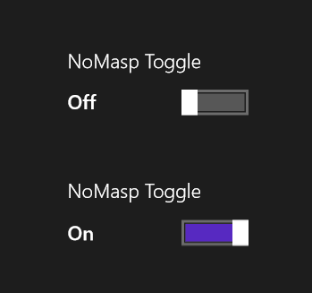
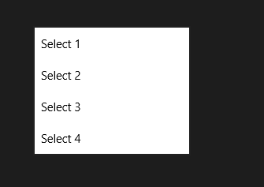
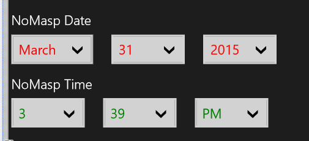
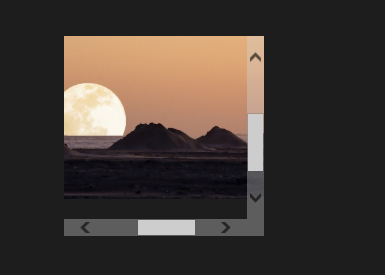
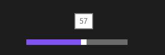
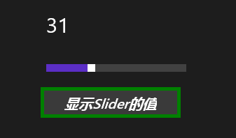

# 部分控件介绍

通过前面的学习，已经见过一些控件了，现在起将逐步见到更多控件。但由于控件太多，教程中无法一一介绍，请自行举一反三。教程内容也将不断更新。

## Button

前面最常用的控件就是 Button 了，Button 还有一个有意思的属性，当把鼠标指针放在 Button 上时，就会在 Button 的头顶冒出一串文本。

```
<Button ToolTipService.ToolTip="Go to www.blog.csdn.net/nomasp" Margin="692,458,0,230"/>
```

Button 有一个很有意思的属性。

```
<Button Content="摩天轮" Margin="134,363,0,367">               
    <ToolTipService.ToolTip>
        <Image MaxHeight="80" MaxWidth="100" Source="Assets/343219.jpg"/>       
    </ToolTipService.ToolTip>     
</Button>
```

只要把鼠标放到 Button 上面就会显示出这张图片了，也叫做帮助提示吧。其实更简单的方法是下面这种。它显示的是一个后退的样式，而且鼠标放上去会有文字 Back 提示。

```
<Button Content="摩天轮" ToolTipService.ToolTip="Back"
                Style="{StaticResource NavigationBackButtonNormalStyle}" />  
```

## ToggleSwitch

这个控件和 Button 很像，它像开关一样。

```
<ToggleSwitch x:Name="toggleSwitch1" Header="NoMasp Toggle" 
      OnContent="On" OffContent="Off" Toggled="ToggleSwitch_Toggled" 
      Margin="409,468,0,227"/>
<ToggleSwitch x:Name="toggleSwitch2" Header="NoMasp Toggle" 
     OnContent="On" OffContent="Off" IsOn="True" 
     Toggled="ToggleSwitch_Toggled" Margin="409,565,0,130"/>
```



## MessageDialog

这控件和 Button 一起讲还蛮合适的，我们随意添加一个 Button，然后写好 Click 事件如下。

```
private async void Button_Click(object sender, RoutedEventArgs e)
{
    Windows.UI.Popups.MessageDialog messageDialog =
        new Windows.UI.Popups.MessageDialog("噢，你刚刚踩到了地雷！");
    await messageDialog.ShowAsync();
}
```

注意要在函数上加上 async 表示异步。


如果需要预览效果，可以参见教程随后的“用浮出控件做预览效果”。

## ComboBox

ComboBox 提供了下拉列表，自然也是一个很常用的控件。

```
<ComboBox Height="50" Width="200" Name="cbox1"  SelectionChanged="cbox1_SelectionChanged"  
Margin="17,47,1049,671">
     <x:String>Select 1</x:String>
     <x:String>Select 2</x:String>
     <x:String>Select 3</x:String>
     <x:String>Select 4</x:String>
</ComboBox>
```




## ListBox

ListBox 控件和 ComboBox 很相似，都可以让用户选择已经嵌入在列表中的选项。用法如下：

```
<ListBox x:Name="listBox1" SelectionChanged="listBox1_SelectionChanged" Width="100">
    <x:String>Item 1</x:String>
    <x:String>Item 2</x:String>
    <x:String>Item 3</x:String>
</ListBox>
```

## DatePicker、TimePicker

Winows 平台设置时间的控件倒是很有特色，就是 DatePicker 和 TimePicker。

```
<DatePicker Foreground="Red" Header="NoMasp Date" Margin="3,177,0,533"/>
<TimePicker Foreground="Green" Header="NoMasp Time" Margin="3,246,0,464" Width="289"/>    
```

以下既是截图，也是写这篇教程的时间。



这个控件的更多介绍也在教程随后的“时间控件的更多介绍”中。

## FlipView

FlipView 是一个可以让用户逐个浏览的项目集合的控件，下面是相关的示例代码。CommonAssets 文件夹完全可以定义在 Shared 目录下，这样 WP 也可以拿来用了。

```
<FlipView>
    <Image Source="CommonAssets/5083.jpg"/>
    <Image Source="CommonAssets/5503.jpg"/>
    <Image Source="CommonAssets/6121.jpg"/>
</FlipView>
```


除此之外呢，我们还可以在后台代码中添加，下面的第二段代码和第一段类似，不过是用的 List。

```
FlipView flipView = new FlipView();
flipView.Items.Add("Item 1");
flipView.Items.Add("Item 2");
flipView.SelectionChanged += filpView_SelectionChanged;
grid1.Children.Add(flipView);
```

```
List<String> listItems = new List<string>();
listItems.Add("Item 1");
listItems.Add("Item 2");                                                                                                       
FlipView flipView = new FlipView();
flipView.ItemsSource = listItems;
flipView.SelectionChanged += filpView_SelectionChanged;          
grid1.Children.Add(flipView);
```

除了这 2 种方式之外呢，用 CollectionViewSource 来绑定数据也是完全没问题的。

```
<Page.Resources>   
    <CollectionViewSource x:Name="collectionVSFlipView" Source="{Binding Items}"/>
</Page.Resources>
```

上面是一段资源文件，然后 FlipView ListView 的 ItemsSource 添加静态资源绑定就 OK 了。

```
<FlipView x:Name="flipView" 
          ItemsSource="{Binding Source={StaticResource collectionVSFlipView}}"/>
```

如果大家自己试过 FlipView 就会发现它的图片资源等都是左右滚动的，如果要用上下滚动呢？那就用下面这个 ItemsPanelTemplate 模板就好了。

```
<FlipView.ItemsPanel>
     <ItemsPanelTemplate>
          <VirtualizingStackPanel Orientation="Vertical"/>
     </ItemsPanelTemplate>
</FlipView.ItemsPanel>
```

## ScrollBar

如果有缩放图片，并且可以滚动以查看图片的需要，那么就可以用ScrollBar啦。这主要是能留给图片的位置太小以至于图片无法全部显示出来。

```
<ScrollViewer ZoomMode="Enabled" MaxZoomFactor="12" HorizontalScrollMode="Enabled"  
HorizontalScrollBarVisibility="Visible" VerticalScrollBarVisibility="Visible"  
VerticalScrollMode="Enabled" Height="200" Width="200" Margin="363,35,803,533">           
    <Image Source="CommonAssets/6121.jpg" Height="400" Width="400"/> 
</ScrollViewer>
```



## Viewbox

还有一个控件则可以将图片等缩放到指定的大小的，那就是 Viewbox。大家看看下面这个图，是不是很炫酷呢。

```
    <Viewbox MaxHeight="33" MaxWidth="33" Margin="23.5,35,-26,-35">
            <Image Source="CommonAssets/5503.jpg" Opacity="0.9 "/>
        </Viewbox>
        <Viewbox MaxHeight="66" MaxWidth="66" Margin="26,35,-26,-35">
            <Image Source="CommonAssets/5503.jpg" Opacity="0.6"/>
        </Viewbox>
        <Viewbox MaxHeight="99" MaxWidth="99" Margin="26,35,-26,-35">
            <Image Source="CommonAssets/5503.jpg" Opacity="0.3"/>
        </Viewbox>
```


## GridView

相信大家都已经看过了 GridView 控件，很多 Modern 应用都会采用的。其和 ComboBox 挺类似的。

```
<GridView x:Name="gView1" SelectionChanged="gView1_SelectionChanged">
    <x:String>Item 1</x:String>
    <x:String>Item 2</x:String>
    <x:String>Item 3</x:String>
</GridView>
```

## HyperlinkButton

HyperlinkButton 既可以作为 Button 来用，也可以用来做超链接。

```
<HyperlinkButton Content="NoMasp--CSDN" NavigateUri="http://blog.csdn.net/nomasp" />
```

## ProgressBar

相信大家都挺喜欢玩进度条的吧？我本人倒是觉得相比于 Win7 及 Vista 等，Win8 的进度条变得更加有意思了。

```
<ProgressBar x:Name="progressBar1" IsIndeterminate="True" Width="100" Margin="607,377,659,385"/>
<ProgressBar x:Name="progressBar2" Value="70 " Width="100" Margin="607,352,659,410"/>
```

第一个图是运行中的进度条啦；第二个图中的上图也就是 progressBar1，其 Value 为 70 的确定进度的进度条，下图则是 progressBar2，是运行中的进度条在设计器中的静止状态。


## ProgressRing

环形的进度条会不会更好玩呢？

```
<ProgressRing x:Name="progressRing1" IsActive="True" />
```


## Slider

比如说 win8 上的音量呀、屏幕亮度呀，这些地方都用到了滑动条。这里来看看它的 ThumbToolTipValueConverter 属性吧。为了将值绑定到 Slider 上，我们需要有一个类，这个类需要一个为数据绑定提供值转换的接口。可视化元素也就是 Slider 为绑定目标，其有 2 个方向：数据源->数据->绑定目标，绑定目标->数据->数据源。

我们需要写一个类，可以直接在 MainPage.xaml.cs 下写，但更好是单独新建一个类，再考虑到这个是通用应用，所以将类新建到 Shared 下比较合适。

```
public class ThumbToolTipValueConverter : Windows.UI.Xaml.Data.IValueConverter
{
    public object Convert(object value, Type targetType, object parameter, string language)
    {
        if(value is double)
        {
                double dValue= System.Convert.ToDouble(value);
                return dValue;                
        }
        return null;
     }
    public object ConvertBack(object value, Type targetType, object parameter, string language)
    {
        return null;
    }
}
```

然后添加以下代码作为本地实例化的资源即可。

```
<Page.Resources>
   <local:ThumbToolTipValueConverter x:Key="thumbToolTipValueC"/>
</Page.Resources>
```

最后就是传说中的本体啦。

```
<Slider Width="200" Height="50" Name="slider1"    
      ThumbToolTipValueConverter="{StaticResource thumbToolTipValueC}" />
```



我们还可以添加一个 Button 和 TextBlock，让点击来在 TextBlock 上显示 Slider 的 Value。

```
private void btnGetSliderValue_Click(object sender, RoutedEventArgs e)
{
    tblockSlider.Text = slider1.Value.ToString();
}
```

