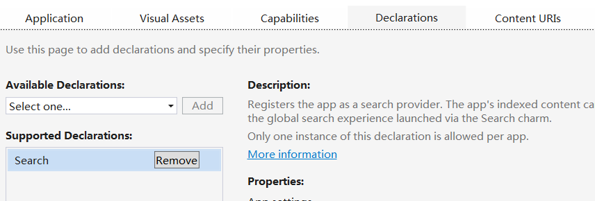
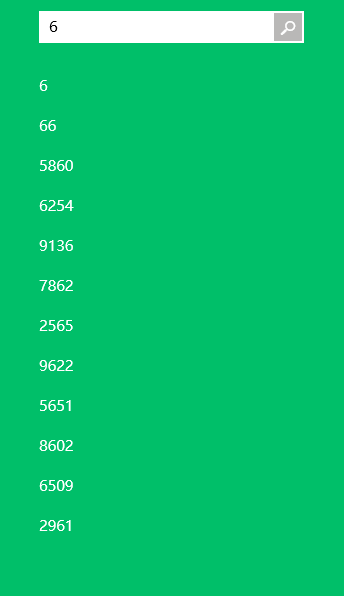

# 在应用中集成搜索

上一节是关于如何添加应用设置和帮助，这一篇讲的是和设置类似的搜索。

So…… Let's do it !

先从简单的页面布局开始，想想我们需要什么，一个带搜索事件的 Button，还需要一些 TextBlock 来提示用户，核心部分自然是一个 GridView 咯。

```
<Grid Background="Wheat">
        <Grid.RowDefinitions>
            <RowDefinition Height="Auto" />
            <RowDefinition />
        </Grid.RowDefinitions>        
        <StackPanel Grid.Row="0" Orientation="Vertical">
            <Button Grid.Row="0" Name="btnSearch" VerticalAlignment="Center" HorizontalAlignment="Left" 
                Content="搜索" FontFamily="华文行楷" Click="btnSearch_Click" Margin="12" FontSize="34" Foreground="Red"/>
            <StackPanel Orientation="Horizontal">
                <TextBlock Text="搜索关键词" Foreground="Green" FontSize="28" Margin="12"/>
                <TextBlock FontSize="28" Foreground="Green" Name="tBlockKeyword" Margin="12"/>
            </StackPanel>                   
        </StackPanel>
        <GridView Grid.Row="1" Margin="12" x:Name="gridView">
            <GridView.ItemsPanel>
                <ItemsPanelTemplate>
                    <WrapGrid Orientation="Horizontal"/>
                </ItemsPanelTemplate>
            </GridView.ItemsPanel>
            <GridView.ItemTemplate>
                <DataTemplate>
                    <TextBlock Text="{Binding}" FontSize="24" Foreground="Pink" FontFamily="楷体"/>
                </DataTemplate>
            </GridView.ItemTemplate>
        </GridView>
    </Grid>
```

既然界面完成了，就该去后台捣鼓咯。搜索的核心在于 SearchPane，所以先来实例化它。为了简化，我们就将待搜索的内容设置为一串字符串数组好了，当然了，初始化数组的方式大家随意就好了。

```
SearchPane searchPane = null;
string[] exampleStr = new string[100];
public  void InitExampleStr()
{
     Random ran = new Random();
     int exNumber;
     for(int i=0;i<100;i++)
     {
          exNumber = ran.Next(1000, 9999);
          exampleStr[i] = exNumber.ToString();                             
      }                                                                                     
}
```
当用户在搜索框中输入的内容发生了更改时就会触发 searchPane_QueryChange 事件。

当用户在完成输入后按下 Enter 键或者点击旁边的搜索确认按钮后就会触发 searchPane_QuerySubmitted 事件。

```
        void searchPane_QueryChanged(SearchPane sender, SearchPaneQueryChangedEventArgs args)
        {                                     
            this.tBlockKeyword.Text = args.QueryText;
        }
        void searchPane_QuerySubmitted(SearchPane sender, SearchPaneQuerySubmittedEventArgs args)
        {       
            string key = args.QueryText;
            var result = exampleStr.Where(s => s.Contains(key)).ToArray();             
            this.gridView.ItemsSource = result;
        }
```

然后我们还需要这两个事件在 OnNavigatedTo 中绑定以及在 OnNavigatedFrom 中解绑。

```
        protected override void OnNavigatedTo(NavigationEventArgs e)
        {
            this.searchPane.QuerySubmitted += searchPane_QuerySubmitted;
            this.searchPane.QueryChanged += searchPane_QueryChanged;
        }
        protected override void OnNavigatedFrom(NavigationEventArgs e)
        {
            this.searchPane.QuerySubmitted -= searchPane_QuerySubmitted;
            this.searchPane.QueryChanged -= searchPane_QueryChanged;
        }
```

然后我们需要点击 Button 控件来调出系统的搜索框，一行代码就足以搞定了。如果不想点击按钮也是可以得哦，可以让用户直接在键盘输入而调出搜索框呢。

```
        private void btnSearch_Click(object sender, RoutedEventArgs e)
        {
            this.searchPane.Show();
        }
```

```
 this.searchPane.ShowOnKeyboardInput = true;
```

最后别忘了将他们都放到 MainPage() 中，

```
		public MainPage()
        {
            this.InitializeComponent();
            searchPane = SearchPane.GetForCurrentView();
            InitExampleStr();              
            this.searchPane.PlaceholderText = "请输入关键字";           
            this.searchPane.ShowOnKeyboardInput = true;
        }
```

所以说，总的代码是这样的。

```
		SearchPane searchPane = null;
        string[] exampleStr = new string[100];
        public MainPage()
        {
            this.InitializeComponent();
            searchPane = SearchPane.GetForCurrentView();
            InitExampleStr();              
            this.searchPane.PlaceholderText = "请输入关键字";           
            this.searchPane.ShowOnKeyboardInput = true;
        }
        public  void InitExampleStr()
        {
            Random ran = new Random();
            int exNumber;
            for(int i=0;i<100;i++)
            {
                exNumber = ran.Next(1000, 9999);
                exampleStr[i] = exNumber.ToString();                             
            }                                                                                     
        }
        protected override void OnNavigatedTo(NavigationEventArgs e)
        {
            this.searchPane.QuerySubmitted += searchPane_QuerySubmitted;
            this.searchPane.QueryChanged += searchPane_QueryChanged;
        }
        protected override void OnNavigatedFrom(NavigationEventArgs e)
        {
            this.searchPane.QuerySubmitted -= searchPane_QuerySubmitted;
            this.searchPane.QueryChanged -= searchPane_QueryChanged;
        }
        void searchPane_QueryChanged(SearchPane sender, SearchPaneQueryChangedEventArgs args)
        {                                     
            this.tBlockKeyword.Text = args.QueryText;
        }
        void searchPane_QuerySubmitted(SearchPane sender, SearchPaneQuerySubmittedEventArgs args)
        {       
            string key = args.QueryText;
            var result = exampleStr.Where(s => s.Contains(key)).ToArray();             
            this.gridView.ItemsSource = result;
        }
        private void btnSearch_Click(object sender, RoutedEventArgs e)
        {
            this.searchPane.Show();
        }
    }
```

在清单文件中声明你需要使用“Search”功能后就可以开始调试咯。




大家肯定都用的音乐播放器肯定都会在搜索框下面给出一些建议吧，或者大家常用的地图等 App。

那么我们就对前面的代码进行更新就好。

下面这段代码呢，就是根据用户的输入来显示建议列表的方法。

```
void searchPane_SuggestionsRequested(SearchPane sender, SearchPaneSuggestionsRequestedEventArgs args)
  {
    var deferralSeg= args.Request.GetDeferral();
    var q = from i in exampleStr
            where i.Contains(args.QueryText)
            select i;
    var res = q.Take(suggestionLen).ToArray();
    foreach (var item in res)
      {
        args.Request.SearchSuggestionCollection.AppendQuerySuggestion(item);
      }
    deferralSeg.Complete();
  }       
```

这篇博客，使用大量 LINQ 技术，如果不太懂的话可以看看这里。
[【LINQ 技术】扩展特性和 LINQ 操作符](http://blog.csdn.net/nomasp/article/details/45461517) 

使用搜索建议的最大好处在于我们可以选择并非自己输入的内容，这个功能就由下面这段代码提供动力支持。

```
void searchPane_ResultSuggestionChosen(SearchPane sender,  
SearchPaneResultSuggestionChosenEventArgs args)
  {                      
    sender.TrySetQueryText(args.Tag);
    var q = from t in exampleStr
            where t.Contains(args.Tag)
            select t;
   this.gridView.ItemsSource = q.ToArray();
 }
```

我们还可以对前面的 searchPane_QuerySubmitted 函数做如下修改。

```
		void searchPane_QuerySubmitted(SearchPane sender, SearchPaneQuerySubmittedEventArgs args)
        {
            //var q = from extStr in exampleStr
            //        where extStr.Contains(args.QueryText)
            //        select extStr;
            //this.gridView.ItemsSource = q.ToArray();
            string key = args.QueryText;
            var result = exampleStr.Where(s => s.Contains(key)).ToArray();
            this.gridView.ItemsSource = result;
        }
```

最后还需要将他们添加到 OnNavigatedTo 和 OnNavigatedFrom 方法中。

```
		protected override void OnNavigatedTo(NavigationEventArgs e)
        {
            this.searchPane.QuerySubmitted += searchPane_QuerySubmitted;
            this.searchPane.QueryChanged += searchPane_QueryChanged;
            this.searchPane.SuggestionsRequested += searchPane_SuggestionsRequested;
            this.searchPane.ResultSuggestionChosen += searchPane_ResultSuggestionChosen;
        }
        protected override void OnNavigatedFrom(NavigationEventArgs e)
        {
            this.searchPane.QuerySubmitted -= searchPane_QuerySubmitted;
            this.searchPane.QueryChanged -= searchPane_QueryChanged;
            this.searchPane.SuggestionsRequested -= searchPane_SuggestionsRequested;
            this.searchPane.ResultSuggestionChosen -= searchPane_ResultSuggestionChosen;
        }
```

然后调试就会是这个效果咯。

