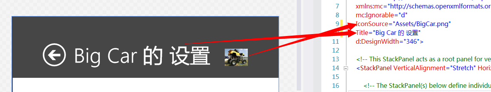
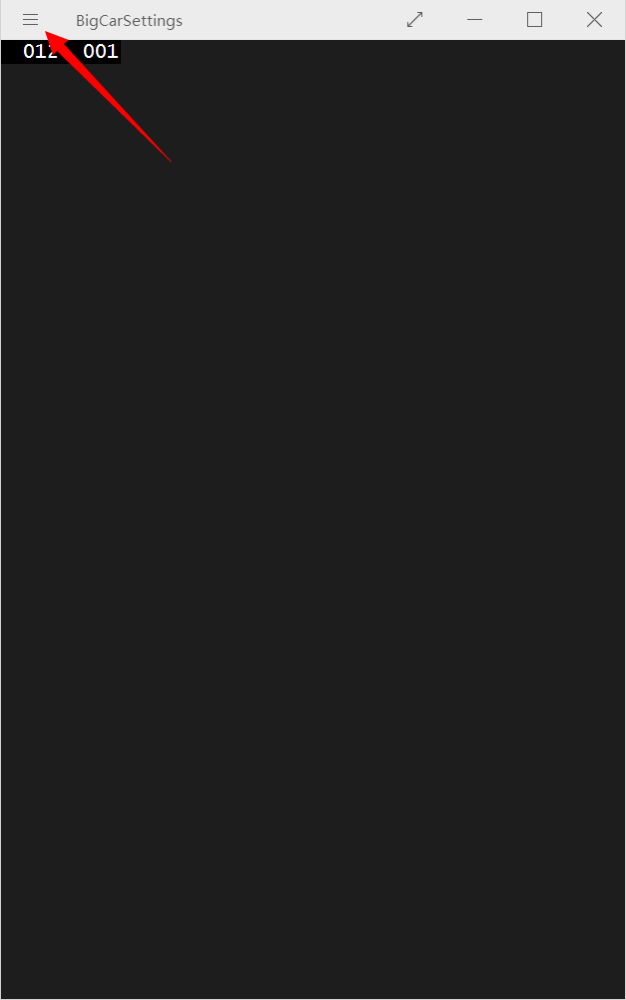
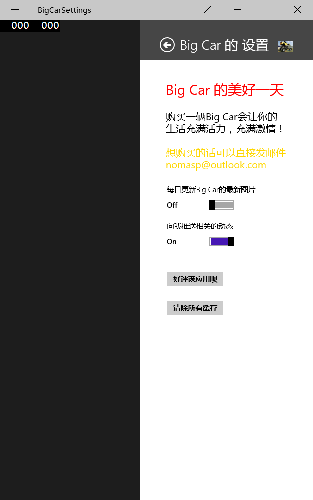

# 应用设置和应用帮助

## ”设置“合约

上一节中我们学习了如何将应用设置保存到本地，这种方式是通过在 App 内添加设置选项，这里还有一种方式。微软将其称为“设置”合约，并且所有的 Windows 应用商店应用都将自动配合这种合约。但是应用自带的这种设置如果不做任何修改可谓毫无作用。而我们添加这些设置则可以让应用更加个性化哦。

### SettingsFlyout

首先新建一个 SettingsFlyout 页面，也许很多童鞋会像我当初学这个一样立马就调试程序等着看看这个设置是长什么样，不过现在还用不了哦。

如下所示，我们可以修改 IconSource 来改变”设置“中的图标。



然后我将设置界面的布局设置如下咯。

    <StackPanel VerticalAlignment="Stretch"  HorizontalAlignment="Stretch" Orientation="Vertical">
    <StackPanel Orientation="Vertical" >
     <TextBlock Text="Big Car 的美好一天" FontSize="28" Foreground="Red" Margin="12"/>
     <TextBlock Text="购买一辆Big Car会让你的生活充满活力，充满激情！" FontSize="20"  
     Margin="12" TextWrapping="Wrap" Foreground="Black"/>
     <TextBlock Text="想购买的话可以直接发邮件 nomasp@outlook.com" FontSize="20" Margin="12"  
    Foreground="Gold" TextWrapping="Wrap"/>
    </StackPanel>
    <StackPanel Orientation="Vertical" Margin="8">
     <ToggleSwitch x:Name="toggleSwitch1" Header="每日更新Big Car的最新图片"  OnContent="On"  
     OffContent="Off" Toggled="ToggleSwitch_Toggled" />
     <ToggleSwitch x:Name="toggleSwitch2" Header="向我推送相关的动态" OnContent="On"  
     OffContent="Off" Toggled="ToggleSwitch_Toggled" IsOn="True"/>
     </StackPanel>
     <StackPanel Orientation="Vertical" Margin="0,12,0,12">
     <Button Content="好评该应用呗" Margin="12"/>
     <Button Content="清除所有缓存" Margin="12"/>
    </StackPanel>
    </StackPanel>

## App.xaml.cs

先在 app.xaml.cs 中添加下面这条命名空间，和以下 3 个方法

```
using Windows.UI.ApplicationSettings;
```

```
protected override void OnWindowCreated(WindowCreatedEventArgs args)
{
    SettingsPane.GetForCurrentView().CommandsRequested += OnCommandsRequested;
}
private void OnCommandsRequested(SettingsPane sender,SettingsPaneCommandsRequestedEventArgs args)
{
    args.Request.ApplicationCommands.Add(new SettingsCommand("BigCarMainSettings", "Big Car  
    的主要设置", (handler) => ShowCustomSettingFlyout()));
}
public void ShowCustomSettingFlyout()
{
    BigCarSettings CustomSettingFlyout = new BigCarSettings();
    CustomSettingFlyout.Show();
}
```






当然了，在那些控件中的点击啥的最后都要在后台代码中添加的，就像上一篇博客那样来保存设置就好啦。

以上就是关于应用设置同样的内容咯，而应用帮助嘛，和这些都是一样的呀。创建同样的目标就好了。然后在XAML中修改成自己喜欢的样子就好啦。而且和应用设置一样，我们也可以在底部设置应用栏的，关于应用栏的内容可以查看第三章的“应用栏”一节。

```
protected override void OnWindowCreated(WindowCreatedEventArgs args)
{
     SettingsPane.GetForCurrentView().CommandsRequested += OnCommandsRequested;
}
private void OnCommandsRequested(SettingsPane sender, SettingsPaneCommandsRequestedEventArgs args)
{
      args.Request.ApplicationCommands.Add(new SettingsCommand("BigCarHelp", "Big Car 的帮  
      助", (handler) => ShowHelpSettingsFlyout()));
}
public void ShowHelpSettingsFlyout()
{
      BigCarHelphelpSF = new BigCarHelp();
      helpSF.Show();
}
```