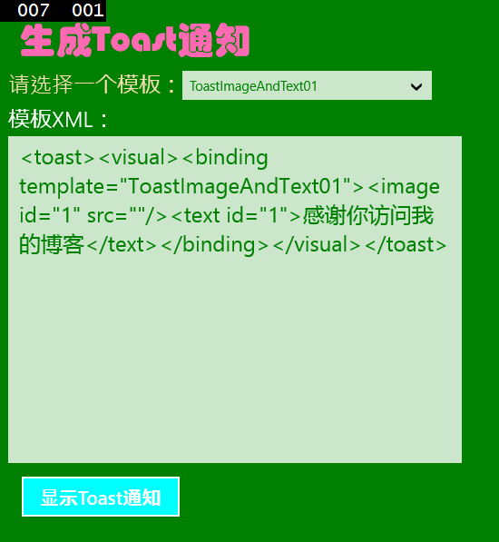
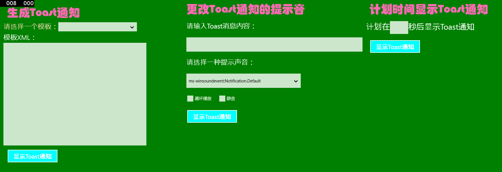

# 使用 Toast 通知示例

前面我们使用了 MessageDialog 来作为弹窗，这里来介绍一个更加高大上的 Toast 通知。

Toast 通知本质上动力是由XML来提供的，一开始我还不相信不知道XML原来有这么大的威力。现在就来看看和 Toast 相关的知识。

1）实例化 ToastNotification 类。

```
ToastNotification toast1 = new ToastNotification(xdoc);            
```

2）使用 ToastNotificationManager 来管理 Toast 通知，包括添加、展示、移除、获取通知等等。

```
ToastNotificationManager.CreateToastNotifier().Show(toast1);
```

3）在第一步中的 xdoc 就是一段 XML 数据，它从何而来呢？

```
XmlDocument xdoc = new XmlDocument();
```

4）上一步代码实例化了一个 XML，但是它没有数据呀，数据从哪来呢？

```
xdoc.LoadXml(txtXML.Text);
```

5）这段代码就将一段 Text 导入了 XML 中。而 Text 数据有很多种获取方式。在下文中自然会提到。

Toast 的 XML 模板有许多，我们可以直接来获取它们。用枚举和强大的 var 即可。

```
var items = Enum.GetNames(typeof(ToastTemplateType));
```

那么就正式开工了，因为重复的属性太多了我就大概设置了 2 个 Style 资源。

```
	<Page.Resources>
        <Style TargetType="TextBlock" x:Key="StyleHeaderTextBlock">
            <Setter Property="FontSize" Value="40"/>
            <Setter Property="FontFamily"  Value="华文琥珀"/>
            <Setter Property="Foreground" Value="HotPink"/>
            <Setter Property="Margin" Value="12"/>
        </Style>       
        <Style TargetType="Button" x:Key="StyleToastButton">
            <Setter Property="Width" Value="180"/>
            <Setter Property="Height" Value="50"/>
            <Setter Property="Background" Value="Aqua"/>
            <Setter Property="FontSize" Value="21"/>
            <Setter Property="Margin" Value="12"/>
            <Setter Property="Content" Value="显示Toast通知" />
        </Style>
    </Page.Resources>
```

下面是第一部分用于生成 Toast 通知。

```
<StackPanel Orientation="Vertical" Grid.Column="0" Margin="12">
<TextBlock Text="生成Toast通知" Style="{StaticResource StyleHeaderTextBlock}"/>
<StackPanel Orientation="Horizontal" HorizontalAlignment="Left">
<TextBlock FontSize="24" Foreground="Wheat" Text="请选择一个模板：" VerticalAlignment="Center"/>
<ComboBox Name="comboBoxToast" Foreground="Green"  Width="275" 
  SelectionChanged="comboBoxToast_SelectionChanged"/>
</StackPanel>
<TextBox Foreground="Green" x:Name="txtXML" HorizontalAlignment="Left" Width="500"  
Height="400" Header="模板XML：" TextWrapping="Wrap" FontSize="24"/>
<Button Name="btnShowToast1" Click="btnShowToast1_Click"  Style="{StaticResource StyleToastButton}"/>
</StackPanel>
```

后台代码也蛮容易的，利用上面讲的就好了。

```
public MainPage()
  {
    this.InitializeComponent();   
    var items = Enum.GetNames(typeof(ToastTemplateType));
    this.comboBoxToast.ItemsSource = items;
  }
private void comboBoxToast_SelectionChanged(object sender, SelectionChangedEventArgs e)
  {
    string tempt = ((ComboBox)sender).SelectedItem as string;
    if (!string.IsNullOrEmpty(tempt))
      {   
        ToastTemplateType template = (ToastTemplateType)Enum.Parse(typeof(ToastTemplateType), tempt);
        XmlDocument xdoc = ToastNotificationManager.GetTemplateContent(template);
        txtXML.Text = xdoc.GetXml();
       }
  }
private void btnShowToast1_Click(object sender, RoutedEventArgs e)
  {
    if (txtXML.Text == "")   
    return;  
    XmlDocument xdoc = new XmlDocument();
    xdoc.LoadXml(txtXML.Text);  
    ToastNotification toast1 = new ToastNotification(xdoc);
    ToastNotificationManager.CreateToastNotifier().Show(toast1); 
  }
```

模板是这样用的……




在 src 中填入图片的路径也可以在 Toast 中显示图像哦，赶紧试试吧……

接下来是第二段啦，和前面的很是类似……

```
	<StackPanel Orientation="Vertical" Grid.Column="1">
            <TextBlock Text="更改Toast通知的提示音" Style="{StaticResource StyleHeaderTextBlock}"/>
            <TextBlock Margin="12" Text="请输入Toast消息内容：" FontSize="24"/>
            <TextBox Margin="12" Height="50" x:Name="txtMesaage"/>
            <TextBlock  Margin="12" FontSize="24" Text="请选择一种提示声音："/>
            <ComboBox Margin="12" Height="50" x:Name="comboBoxAudio" Width="400" HorizontalAlignment="Left">
                <ComboBoxItem IsSelected="True">ms-winsoundevent:Notification.Default</ComboBoxItem>
                <ComboBoxItem>ms-winsoundevent:Notification.IM</ComboBoxItem>
                <ComboBoxItem>ms-winsoundevent:Notification.Mail</ComboBoxItem>
                <ComboBoxItem>ms-winsoundevent:Notification.Reminder</ComboBoxItem>
                <ComboBoxItem>ms-winsoundevent:Notification.Looping.Alarm</ComboBoxItem>
                <ComboBoxItem>ms-winsoundevent:Notification.Looping.Call</ComboBoxItem>
            </ComboBox>
            <StackPanel Orientation="Horizontal">
                <CheckBox x:Name="checkBoxLoop" Margin="12" Content="循环播放"/>
                <CheckBox x:Name="checkBoxSilent" Margin="12" Content="静音"/>
            </StackPanel>           
            <Button Name="btnShowToast2" Click="btnShowToast2_Click"  Style="{StaticResource StyleToastButton}"/>
        </StackPanel>
```

上面代码中的“ms-winsoundevent:Notification.Default”都是填到 src 中的用于设置声音，还可以在 loop、silent 中设置是否循环以及是否静音，那到底该怎么用呢？应该将这些属性全部都填入到 XML 中。

```
xmlContent = string.Format(
     "<toast duration='{0}'>" +
           "<visual>" +
                "<binding template='ToastText01'>" +
                      "<text id='1'>{1}</text>" +
                "</binding>" +
           "</visual>" +
		   "<audio src='{2}' loop='{3}' silent='{4}'/>" +
     "</toast>",
     toastDuration, msg, audioSrc, isLoop, isSilent    
);             
```

上面用的 xmlContent 也要先定义出来，一开始设置为 Empty 就好。

```
string xmlContent = string.Empty;  
```

isLoop 和 isSilent 属性都可以借助于三目运算符在 CheckBox 中获取来。

```
string isLoop = checkBoxLoop.IsChecked == true ? "true" : "false";                                
string audioSrc = (comboBoxAudio.SelectedItem as ComboBoxItem).Content.ToString();          
string toastDuration = checkBoxLoop.IsChecked == true ? "long" : "short";            
string isSilent = checkBoxSilent.IsChecked == true ? "true" : "false";        
```

当然，考虑得更加周到些，用户可以在还没有输入通知内容就点了显示 Toast 通知按钮，对此用三目运算符也是极好的选择。

```
string msg = txtMesaage.Text == "" ? "你还没有输入Toast通知的内容呢……" : txtMesaage.Text;   
```

这些准备工作都写好了以后呢就该设置 Toast 通知了，和上面的 Toast1 类似哦，大家试试。

可是这些通知都没有时间性可言，因为有时候我们需要定在一个时间来执行 Toast 通知。这自然也是可以实现的。

先作如下界面设计。

```
	  <StackPanel Orientation="Vertical" Grid.Column="2">
            <TextBlock Text="计划时间显示Toast通知" Style="{StaticResource StyleHeaderTextBlock}"/>  
            <StackPanel Orientation="Horizontal" Height="60">
                <TextBlock FontSize="28" Text="计划在"  VerticalAlignment="Center"/>
                <TextBox Name="tBoxTime" FontSize="28" Width="60" Height="45" VerticalAlignment="Center"/>
                <TextBlock FontSize="28" Text="秒后显示Toast通知" VerticalAlignment="Center"/>
            </StackPanel>                
            <Button Name="btnShowToast3" Click="btnShowToast3_Click"  Style="{StaticResource StyleToastButton}"/>
        </StackPanel>
```

后台代码如下。

```
	    private async void btnShowToast3_Click(object sender, RoutedEventArgs e)
        {
            int toastTime;
            try
            {                      
                toastTime = int.Parse(tBoxTime.Text.ToString());
                XmlDocument xdoc = ToastNotificationManager.GetTemplateContent(ToastTemplateType.ToastText01);                
                var txtnodes = xdoc.GetElementsByTagName("text");                
                txtnodes[0].InnerText = "你好，这是一条定时为"+toastTime.ToString()+ "秒的Toast消息。";              
                ScheduledToastNotification toast3 = new ScheduledToastNotification(xdoc,  
                DateTimeOffset.Now.AddSeconds(toastTime));  
                ToastNotificationManager.CreateToastNotifier().AddToSchedule(toast3);  
            }
            catch (Exception ex)
            {                  
                Windows.UI.Popups.MessageDialog messageDialog =    
                    new Windows.UI.Popups.MessageDialog(ex.Message);
                await messageDialog.ShowAsync();
            }             
        }   
```

在这个小程序中因为侧重于讲解定时而非 Toast 的通知样式，因此就选用了比较简单的 ToastText01 模板。而后找出 Text 节点，并向该节点写入内容。最后就是创建 Toast 通知了。

```
ScheduledToastNotification toast3 = new ScheduledToastNotification  
(xdoc,DateTimeOffset.Now.AddSeconds(toastTime));
```

同样为了防止用户没有在 TextBox 中输入时间或输入了错误格式的时间比如“5 秒”而做了 try、catch 异常检测。当然了，在实际产品中，这里可就要做得更加完美了，时间用 TextBox 来输入并不是一件好事，而应用我们前面介绍的 TimePicker。

给这 3 段程序来张全家福吧~

