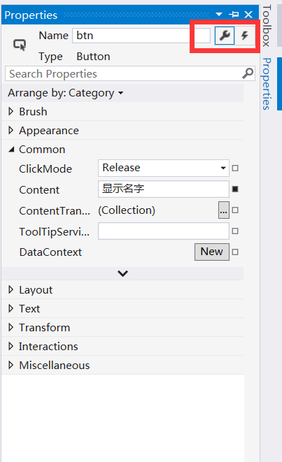

# Visual Studio 使用小技巧

## 行号

我看到蛮多童鞋的 VS 都没有开启行号，而能够看到自己写了多少行代码，无疑会让自己更加有成就感。

点击工具栏上的”工具（Tools）“，然后再点击”选项（Options）“，点开”文本编辑器（Text Editor）“，选择”所有语言（All Language）”，勾上行号即可。

## 快捷键

- 自动对齐：Ctrl+K，Ctrl+F
- 注释代码：Ctrl+E，Ctrl+C（或：Ctrl+K，Ctrl+C）
- 清除代码注释：Ctrl+E，Ctrl+U（或：Ctrl+K，Ctrl+U）

## 视图

- 学习开发时，视图中的“对象浏览器”是非常有用的。
- 可以将工具箱中的控件直接拉入 `MainPage.xaml` 的设计器中。这也就是传说中的“所见即所得”。
- 属性，点击一个空间后点击属性视图，可以设置其的属性和事件。

## 设计器

将鼠标指针放到设计器中，按住 Ctrl 键，然后用鼠标滚轮滑动即可放大或缩小中的视图。鼠标滚轮前后滚动时，设计器中的窗口会上下移动，如果按住 Shift 则会左右移动。同样也是将鼠标指针放到设计器中，安装 Space（也就是空格）键，指针会变成一个小手，这时可以移动设计器。

大家若有更多建议，欢迎邮件我。