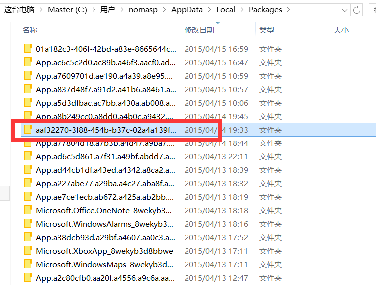
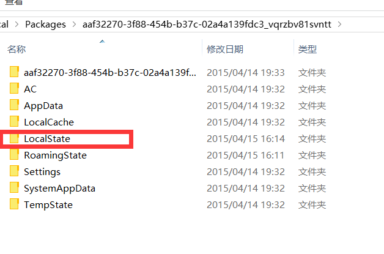

# 写入和读取

## 准备工作

在 XAML 中添加一个 TextBlock 用于显示相关信息，添加一个 Button 来使用它的 Click 事件，当然了，最后分别创建 2 个。

## 创建文件和读取文件

### 实例化 StorageFolder 类

我们的文件不可能让其随意保存在计算机/手机中的任何一个地方，应该先确定它的文件夹，对吧？

在新的 Windows 8 中，微软开启了 Windows 上的 App 时代，下载的软件再也不能随意安装到任何地方了，而是由操作系统统一放到一块叫做“独立存储”的地方。这也是出于安全的考虑。用过 Windows Phone 8 的朋友应该更加清楚了。

那么下面这行代码的 LocalFolder 究竟在哪里呢？

```
StorageFolder folder = Windows.Storage.ApplicationData.Current.LocalFolder;
```

下图中的文件，就是我当前所写的 App。（补充一条哦，一开始我装了 Win8 后，下载了一个游戏，模拟类的，有金币呀什么的，后来我找到这个 App 的文件，将数据改了之后金币就哗哗的啦。当然了，对于其他单机而言这个完全不值一提，但 App 的数据，相信还有很多人没有改过吧。）



那么这张图中的红方框的文件夹就是 LocalFolder 啦，下面还有一个存储漫游文件的文件夹。



不论是读取文件还是写入文件，都得先确定一个文件夹哦。

### 实例化 StorageFile

确定了文件夹，就得确定文件咯。对于创建文件而言，执行以下代码。既然用到了异步，在函数上加上 async 是必不可少的咯，这一点我们在前面讲到过。后面的 ReplaceExisting 属性是指的，如果该文件（名）已经存在了，则替换它。

```
 StorageFile file =
            await folder.CreateFileAsync("New Document.txt", CreationCollisionOption.ReplaceExisting);
```

那么对于读取文件呢，就直接读取好啦。

```
 StorageFile file = await folder.GetFileAsync("sample.txt");
```

### 创建和读取文件

将文本写入文件按照如下代码，将文件名和文本内容（字符串）。

```
await FileIO.WriteTextAsync(file, "Write text to file.");
```

读取文件也是类似的。

```
string text = await FileIO.ReadTextAsync(file);
```

我们还可以将这个读取的字符串传递给前面定义的 TextBlock 来加以调试。以下是完整的代码。

```
 // 创建文件
StorageFolder folder = Windows.Storage.ApplicationData.Current.LocalFolder;
StorageFile file = await folder.CreateFileAsync("New Document.txt", CreationCollisionOption.ReplaceExisting);
await FileIO.WriteTextAsync(file, "Write text to file.");
```

```
// 2  从文本读取文件
StorageFolder folder = Windows.Storage.ApplicationData.Current.LocalFolder;
StorageFile file = await folder.GetFileAsync("sample.txt");
string text = await Windows.Storage.FileIO.ReadTextAsync(file);
tBlockReadInfo.Text = text;
```

### 使用缓冲区将字节写入到文件或从文件读取字节

1.实例化 StorageFolder 类
同上。

2.实例化 StorageFile
同上。

3.将字节写入到文件

a.建立缓冲区

    var buffer = Windows.Security.Cryptography.CryptographicBuffer.ConvertStringToBina  
    ("There's buffer ...... ", Windows.Security.Cryptography.BinaryStringEncoding.Utf8);

b.将缓冲区中的字节写入到文件

```
await Windows.Storage.FileIO.WriteBufferAsync(file, buffer);
```

4.从文件读取字节

a.将文件加载到缓冲区

```
var buffer = await Windows.Storage.FileIO.ReadBufferAsync(file);
```

b.实例化 DataReader，读取缓冲区

```
DataReader dataReader = Windows.Storage.Streams.DataReader.FromBuffer(buffer);
```

c.从 DataReader 对象中读取字符串

```
string text = dataReader.ReadString(buffer.Length);
```

### 使用流将文本写入文件或从文件读取文本

1.实例化 StorageFolder 类
同上。

2.实例化 StorageFile
同上。

3.新建流，并异步地将 file 打开，使用可读写的方式

```
var stream = await file.OpenAsync(Windows.Storage.FileAccessMode.ReadWrite);
```

4.将文本写入到文件

a.使用 using

```
using (var writeStream= stream.GetOutputStreamAt(0))
{
	......
}
```

b.（在 using 语句的花括号内）创建 DataWriter 对象，并调用 DataWriter.WriteString 方法，将文本写入到 writeStream 中

```
DataWriter dataWriter = new DataWriter(writeStream);
dataWriter.WriteString("Stream is a good thing.");
```

c.将文本保存到文件中，并通过 StoreAsync 和 FlushAsync 方法存储和关闭流

```
await dataWriter.StoreAsync();
await writeStream.FlushAsync();
```

5.从文件读取文本

a.获取该流的 size

```
var size = stream.Size;
```

b.使用 using

```
using (var readStream = stream.GetOutputStreamAt(0))
{
	......
}
```

c.（在 using 语句的花括号内）创建 DataWriter 对象，并调用 LoadAsync 方法，最后调用 ReadString 即可。最后还可以将信息输出到 TextBlock 中。

```
DataReader dataReader = new DataReader(readStream);
uint uintBytes = await dataReader.LoadAsync((uint)size);
string text = dataReader.ReadString(uintBytes);
tBlockReadInfo.Text = text;
```